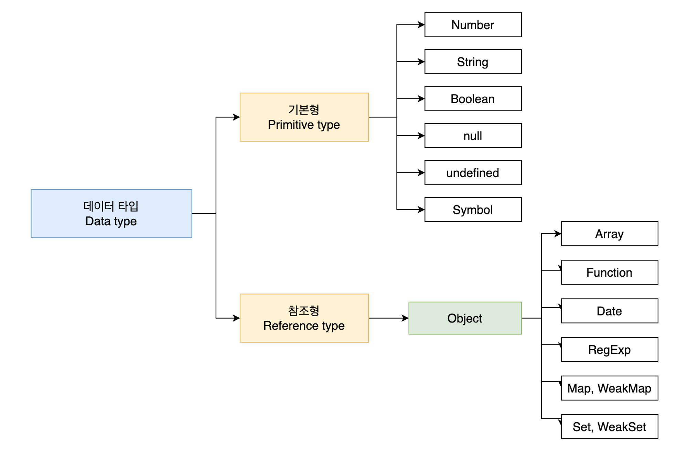

<div style="max-width:800px; margin:0 auto">

## 데이터 타입의 종류 및 메모리

---



자바스크립트는 다양한 종류의 값을 저장하고 조작할 수 있는 여러 내장 데이터 유형을 지원합니다.

### 기본형

1. **Number** 숫자 값을 나타냅니다. 정수 또는 부동 소수점 숫자일 수 있습니다. 예: `42`, `3.14`.
2. **String**: 작은따옴표(`'`) 또는 큰따옴표(`"`)로 묶인 텍스트 데이터를 나타냅니다(예: `'Hello'`, `"JavaScript"`).
3. **Boolean**: 'true' 또는 'false'일 수 있는 논리 값을 나타냅니다. 조건부 분기 및 논리 연산에 사용됩니다.
4. **Null**: 개체 값이 의도적으로 없음을 나타냅니다. 개체 참조가 없음을 나타내는 기본 값입니다. 예: `null`.
5. **undefined**: 선언되었지만 값이 할당되지 않은 변수를 나타냅니다. 정의된 값이 없음을 나타냅니다. 초기화되지 않은 변수는 기본적으로 '정의되지 않음'으로 설정됩니다.
6. **Symbol**: ECMAScript 6(ES6)에서 도입된 고유 식별자를 나타냅니다. 기호는 이름 충돌을 피하기 위해 개체의 속성 키로 자주 사용됩니다.

### **참조형**

1. **객체**: 키-값 쌍 또는 속성 모음을 나타냅니다. 객체는 객체 리터럴(`{}`)을 사용하거나 생성자 함수를 인스턴스화하여 생성할 수 있습니다. 예: `{ 이름: 'John', 연령: 25 }`.
2. **배열**: 정렬된 값 목록을 나타냅니다. 배열은 단일 변수에 여러 값을 저장할 수 있습니다. 대괄호(`[]`)를 사용하여 생성됩니다. 예: `[1, 2, 3, 4]`.
3. **함수**: 함수는 특정 작업을 수행하는 재사용 가능한 코드 블록입니다. JavaScript에서 함수는 또한 일급 객체로 간주됩니다. 즉, 변수에 할당되고 다른 함수에 인수로 전달되며 함수에서 값으로 반환될 수 있습니다.

```jsx
function add(a, b) {
  return a + b;
}
```

1. **날짜**: `날짜` 개체는 JavaScript에서 날짜 및 시간 작업에 사용됩니다. 날짜 및 시간을 검색하고 조작하는 다양한 방법을 제공합니다. 날짜는 `new Date()` 생성자를 사용하여 만들 수 있습니다

```jsx
const currentDate = new Date();
```

1. **RegExp**: 정규식(RegEx라고도 함)은 패턴 일치 및 문자열 조작에 사용됩니다. `RegExp` 개체는 정규식과 함께 작동하는 메서드와 속성을 제공합니다. 정규 표현식은 `/pattern/` 구문 또는 `RegExp` 생성자를 사용하여 생성됩니다.

```jsx
const pattern = /abc/;
const regExp = new RegExp("abc");
```

1. **Map**: `Map` 개체는 키-값 쌍의 모음입니다. 임의의 값을 키와 값으로 저장할 수 있으며 항목을 검색, 추가, 제거 및 조작하는 방법을 제공합니다. 'Map'의 키는 모든 데이터 유형이 될 수 있으며 삽입 순서를 유지합니다
2. **WeakMap**: `WeakMap` 개체는 `Map`과 유사하지만 약간의 차이점이 있습니다. 'WeakMap'의 키는 객체여야 하며 해당 객체에 대한 참조는 약하게 유지됩니다. 즉, 키 개체에 대한 다른 참조가 없으면 garbage-collect 될 수 있습니다. 'WeakMap'은 메모리 누수를 일으키지 않고 기존 객체에 추가 데이터를 연결해야 할 때 주로 사용됩니다.
3. **Set**: `Set` 개체는 각 값이 한 번만 발생할 수 있는 고유한 값의 모음입니다. 추가, 삭제, 값의 존재 확인 및 삽입 순서대로 요소를 반복하는 메서드를 제공합니다
4. **WeakSet**: `WeakSet` 개체는 `Set`과 유사하지만 저장된 개체에 대한 약한 참조도 포함합니다. 'WeakMap'과 마찬가지로, 이는 'WeakSet'의 개체에 대한 다른 참조가 없는 경우 garbage-collect 될 수 있도록 합니다

\*garbage-collect : garbage-collect는 JavaScript를 포함한 프로그래밍 언어 런타임에서 수행되는 자동 메모리 관리 프로세스입니다. 더 이상 필요하지 않거나 프로그램에서 도달할 수 없는 개체가 차지하는 메모리를 회수하여 리소스를 확보하고 메모리 누수를 방지합니다.

### 기본형과 참조형의 구분 기준은 ?

---

1. **복제의 방식**
   1. 기본형 : 값이 담긴 주소값을 바로 복제
   2. 참조형 : 값이 담긴 주소값들로 이루어진 묶음을 가리키는 주소값을 복제
2. **불변성의 여부**

   1. 기본형 : 불변성을 띔
   2. 참조형 : 불변성을 띄지 않음

   💡 **불변성**을 이해하기 위해서는 메모리와 데이터에 대한 내용을 이해해야 합니다
   <br>

      <details>
      <summary>메모리와 데이터에 관한 배경지식</summary>
      <div markdown="1">
     
    1. 비트
        1. 컴퓨터가 이해할 수 있는 가장 작은 단위죠
        2. 0과 1을 가지고 있는 **메모리를 구성하기 위한 작은 조각**을 의미한다고 보면 될 것 같아요!
        3. 이 작은 조각들이 모여서 여러분들이 흔히 들으시는 **‘메모리’**가 만들어지는 것이죠.
    2. 바이트
        1. 0과 1만 표현하는 비트를 모두 찾기는 부담
        2. 1개 → 2개 → … → 8개(새로운 단위 : byte)
            
    3. 메모리(memo + ry) : byte 단위로 구성
        1. 모든 데이터는 byte 단위의 식별자인 메모리 주소값을 통해서 서로 구분이 됩니다.
        
        <aside>
        💡 **만일, 64비트(8바이트) 정수는 메모리에 어떻게 저장할 수 있을까요?**
        ⇒ 64비트를 8개의 바이트로 분할하고, 각 바이트를 메모리에 저장해야 해요. 각 바이트는 8개의 비트를 가므로 64비트 정수는 메모리에서 **8개의 연속된 바이트**에 저장된답니다.
        
        </aside>
        
    4. java, c와 다른 javascript의 메모리 관리 방식(feat. 정수형)
        1. 8을 저장하는 방법
            1. JS : let a = 8(8byte)
            2. JAVA
                1. byte a = 8(1byte)
                2. short a = 8(2byte)
                3. int a = 8(4byte)
                4. long a = 8(16byte)
        2. java 또는 c언어가 초기에 등장했을 때 숫자 데이터 타입은 크기에 따라 다양하게 지정해줘야 할 만큼 개발자가 **handling 할 요소**들이 많았어요. 하지만 javascript는 이런 부분에서는 상당히 편리하죠. 메모리 이슈까지는 고민하지 않아도 되니까요 😎
       </div>
       </details>

- 컴퓨터에는 다양한 유형의 메모리가 있지만 RAM(Random Access Memory)이라고도 하는 기본 시스템 메모리에 집중해 보겠습니다. RAM은 프로세서의 데이터에 대한 빠른 액세스를 제공하는 휘발성 메모리 형태입니다.
- RAM은 메모리 셀 또는 바이트라고 하는 작고 동일한 크기의 단위로 나뉩니다. 각 메모리 셀에는 고유한 주소가 있으므로 주소를 지정하여 데이터를 저장하고 검색할 수 있습니다. 각 바이트는 일반적으로 8비트의 데이터를 보유합니다
- JavaScript 프로그램이 실행될 때 메모리를 사용하여 변수, 개체, 함수 및 기타 데이터 구조를 저장하고 조작합니다.

1. **기본 값**: 기본 값(예: 숫자, 문자열, 부울)을 보유하기 위해 변수를 만들면 값 자체가 해당 변수와 연결된 메모리 셀에 직접 저장됩니다. 예를 들어:

   ```jsx
   let num = 42;
   ```

   이 경우 값 '42'는 변수 'num'에 할당된 메모리 셀에 직접 저장됩니다.

2. **참조 값**: 참조 값(예: 객체, 배열, 함수)을 보유하기 위해 변수를 생성할 때 값의 실제 데이터는 메모리의 다른 곳에 저장되고 변수는 참조(또는 포인터)를 보유합니다. 데이터가 저장되는 메모리 위치로. 예를 들어:

   ```jsx
   let obj = { name: "John", age: 25 };
   ```

   여기서 객체 `{ name: 'John', age: 25 }`는 메모리의 다른 곳에 저장되며 변수 `obj`는 해당 객체의 메모리 위치에 대한 참조를 보유합니다.

JavaScript의 메모리 관리는 JavaScript 엔진 및 런타임 환경에 의해 처리되며 세부 사항은 구현에 따라 다를 수 있다는 점에 유의하는 것이 중요합니다. JavaScript 엔진의 garbage-collect는 개체가 더 이상 참조되지 않는 경우와 같이 더 이상 필요하지 않은 메모리를 회수하는 역할을 합니다.

이것은 JavaScript 맥락에서 메모리 저장에 대한 간단한 설명입니다. 실제로 메모리 관리에는 다양한 최적화 기술, 메모리 할당 전략, CPU 캐시 및 가상 메모리 시스템과 같은 추가 메모리 계층 구조가 포함됩니다.

</div>
