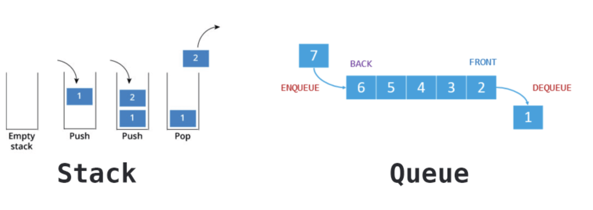
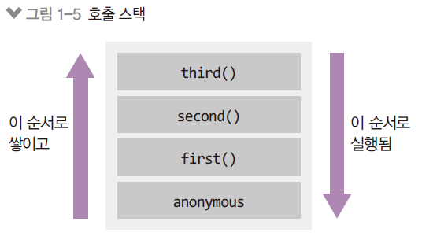
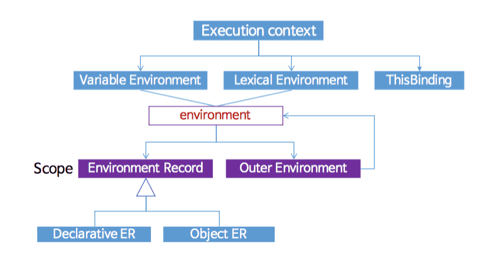
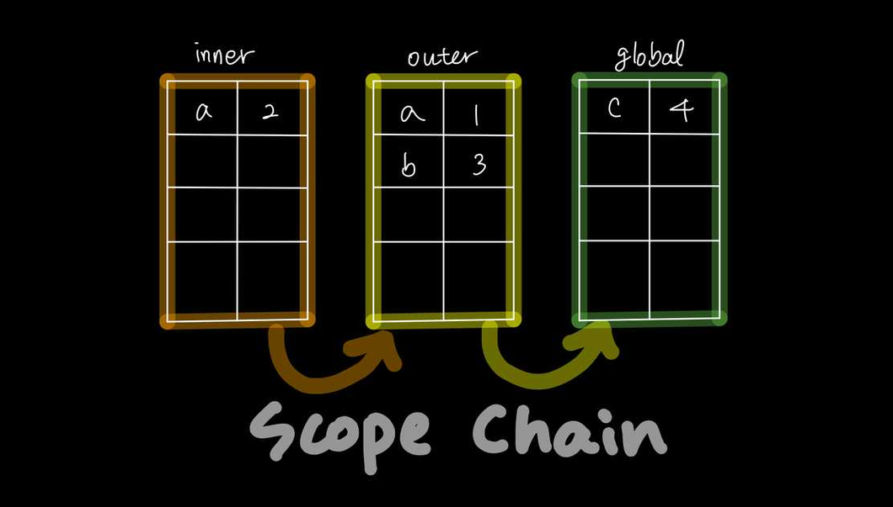
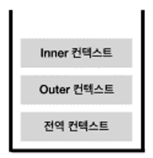

<div style="max-width:800px; margin:0 auto; line-height:28px">

# 실행 컨텍스트

---

## (1)실행 컨텍스트란 ?

JavaScript에서 `실행 컨텍스트`는 JavaScript 코드가 평가되고 실행되는 환경 또는 범위와 관련된 개념 또는 실행할 코드에 제공할 **환경 정보**들을 모아놓은 **객체**입니다. 코드가 JavaScript에서 실행될 때마다 실행 컨텍스트 내에서 실행됩니다.

JavaScript 엔진은 코드가 실행될 때마다 실행 컨텍스트를 생성합니다. 실행 컨텍스트에는 두 가지 유형이 있습니다.

1. **글로벌 실행 컨텍스트(GEC):** JavaScript는 코드가 실행되기 전에 글로벌 실행 컨텍스트를 생성합니다. 이것은 전역 범위를 나타내며 함수 내에 있지 않은 모든 변수(즉, 전역 변수)는 GEC에 추가됩니다. JavaScript 프로그램에는 GEC가 하나만 있습니다.
2. **FEC(Functional Execution Context):** 함수가 호출되거나 호출될 때마다 새로운 실행 컨텍스트가 생성됩니다. 이 컨텍스트를 기능 실행 컨텍스트라고 합니다. 각 함수에는 고유한 실행 컨텍스트가 있습니다.

각 실행 컨텍스트는 두 단계로 나눌 수 있습니다.

1. **생성 단계:** 이 단계에서 JavaScript 엔진은 메모리 내부에 변수, 함수 및 인수를 저장합니다. 변수를 '정의되지 않음'으로 설정하고 모든 함수 선언을 메모리에 저장합니다. 또한 현재 실행 컨텍스트에서 "`this`"의 값을 결정합니다.
2. **실행 단계:** 이 단계에서 JavaScript 엔진은 코드를 한 줄씩 실행하고 생성 단계에서 이미 메모리에 저장된 변수에 실제 값을 할당합니다. 또한 함수를 호출할 수도 있습니다(이미 메모리에 있으므로).

이러한 과정을 이해하기 위해서는 , `콜 스택`의 이해가 필요.

## 그전에 **스택**이란?



1. `스택` 은 컴퓨터 과학에서 "스택"은 LIFO(Last In First Out) 원칙을 따르는 데이터 구조입니다. **이는 나중에 들어간 원소가 가장 먼저 나온다는 의미.**
2. `큐` 는 선형 자료구조의 일종으로 FIFO(First In First Out)의 구조를 가집니다.**이는 먼저 들어간 원소가 가장 먼저 나온다는 의미.**

## **그렇다면 콜스택은 ?**

`콜 스택` 은 프로그램에서 여러 함수 호출을 추적하기 위해 JavaScript에서 사용하는 메커니즘입니다. 이것은 "LIFO(Last In, First Out)" 원칙에 따라 작동하는 JavaScript 엔진의 일부입니다. 즉, 스택에 마지막으로 푸시된 함수가 함수가 반환될 때 가장 먼저 나온다는 의미입니다.

### **콜 스택 순서**

1. JavaScript 프로그램이 실행되기 시작하면 JavaScript 엔진이 전역 실행 컨텍스트(Anonymous)를 생성하고 이를 `콜스택`에 푸시합니다.
2. 함수가 호출될 때마다 해당 함수에 대한 새 실행 컨텍스트가 생성되고 호출 스택으로 푸시됩니다. 이 함수 실행 컨텍스트에는 함수의 인수, 지역 변수, 코드에서 현재 실행 중인 정확한 위치에 대한 정보가 포함되어 있습니다.
3. 이 함수가 다른 함수를 호출하면 해당 함수에 대한 새 실행 컨텍스트가 생성되고 호출 스택의 맨 위에 푸시됩니다.
4. 함수 실행이 완료되면 해당 실행 컨텍스트가 호출 스택에서 제거되고 이제 스택 맨 위에 있는 실행 컨텍스트로 제어가 돌아갑니다. 함수에 대한 로컬 변수는 버려집니다.
5. 이 프로세스는 `콜스택`이 비어 있을 때까지 계속됩니다. 즉, 모든 실행 컨텍스트가 스택에서 제거되어 모든 코드 실행이 완료되었음을 의미합니다.
6. 호출 스택이 할당된 것보다 더 많은 공간을 차지하면 "스택 오버플로" 오류가 발생하며, 가장 일반적으로 무한 재귀로 인해 발생합니다.



```jsx
function first() {
  second();
  console.log("first");
}

function second() {
  third();
  console.log("second");
}

function third() {
  console.log("third");
}

first();
```

<aside>

💡 결국은 특정 실행 컨텍스트가 생성되는(또는 활성화되는) 시점이 콜 스택의 맨 위에 쌓이는(노출되는) 순간을 의미하구요. 곧, 현재 실행할 코드에 해당 실행 컨텍스트가 관여하게 되는 시점을 의미한다고 받아들여주시면 정확합니다

</aside>

## (2) **그러면 실행컨텍스트 (스텍에 하나하나 쌓이는 객체)에는 무엇이 있나?**

**VariableEnvironment**

- 현재 컨텍스트 내의 식별자 정보(=record)를 갖고있습니다.
  1. **`var a = 3`**
  2. 위의 경우, **`var a`**를 의미
- 외부 환경 정보(=outer)를 갖고있습니다.
- 선언 시점 LexicalEnvironment의 **snapshot**

**LexicalEnvironment**

- VariableEnvironment와 동일하지만, 변경사항을 실시간으로 반영.

**ThisBinding**

- this 식별자가 바라봐야할 객체



1. **VariableEnvironment:** 특정 컨텍스트에 대한 변수, 함수 및 인수의 정보(=record)입니다. 실행 컨텍스트가 생성되면 호이스팅 프로세스 중에 이 레코드가 채워집니다. 실행 컨텍스트의 생성 단계 후에 VariableEnvironment가 변경되지 않는다는 점은 주목할 가치가 있습니다.
2. **LexicalEnvironment:** 이것 또한 특정 컨텍스트에 대한 변수, 함수 및 인수의 정보입니다. VariableEnvironment와 달리 LexicalEnvironment는 변경할 수 있습니다. 예를 들어, 실행 단계에서 `let` 또는 `const`로 새 변수가 선언되면 업데이트됩니다. LexicalEnvironment는 또한 중첩 함수에 대한 범위 체인을 만드는 데 중요한 역할을 합니다.

   LexicalEnvironment에는 두 가지 구성 요소가 있습니다.(사진에선 양방향이지만 x)

   - **EnvironmentRecord:**
     - 현재 범위에서 만들어진 선언의 레코드입니다. (=record)
     - 함수에 지정된 매개변수 식별자, 함수자체, var로 선언된 변수 식별자 등
     - 컨텍스트 내부를 처음부터 끝까지 **순서대로** 훑어가며 수집**(호이스팅)**
   - **Outer Environment Reference:** 범위 체인 조회를 용이하게 하는 상위 범위의 LexicalEnvironment에 대한 참조입니다. (=outer)

3. **ThisBinding:** 이것은 현재 컨텍스트에서 `this`의 값을 나타냅니다. `this`의 값은 **함수가 호출되는 방식에 따라 결정**됩니다. 전역 객체, 특정 객체 인스턴스(객체에서 메소드가 호출될 때), 생성자 함수에서 새로 생성된 객체 또는 `call`, `apply` , `bind`와 같은 기능을 사용할 때 개발자가 지정한 것을 참조할 수 있습니다.

실행 컨텍스트가 생성되면 VariableEnvironment, LexicalEnvironment 및 ThisBinding의 세 가지를 설정합니다. 그리고 함수가 호출될 때마다 새로운 실행 컨텍스트가 생성되어 호출 스택에 푸시되고 이러한 단계가 반복됩니다.

> 실행 컨텍스트를 생성할 때, VE에 정보를 먼저 담은 다음, 이를 그대로 복사해서 LE를 만들고 이후에는 주로 LE를 활용

## (3) LexicalEnvironment(1) - environmentRocord(=record)와 호이스팅

**호이스팅**은 코드가 실행되기 전에 실행 컨텍스트의 생성 단계에서 변수 및 함수 선언이 포함된 범위의 맨 위로 이동되는 **JavaScript의 동작입니다. 초기화가 아닌 선언만 호이스팅된다는 점에 유의하는 것이 중요**합니다.

- 새 실행 컨텍스트가 생성되면(생성 단계 중) JavaScript 엔진은 변수 및 함수 선언에 대한 컨텍스트 코드를 스캔합니다.
- 모든 변수(`var`로 선언됨) 및 해당 범위 내의 함수 선언은 `VariableEnvironment`에 추가됩니다. 변수는 `정의되지 않음` 값으로 초기화되며 함수 선언은 전체적으로 저장됩니다.
- ES6에 도입된 `let` 및 `const` 선언도 호이스팅되지만 초기화는 호이스팅되지 않습니다. 이를 선언하는 코드 줄이 실행될 때까지 "**초기화되지 않은**" 상태에 놓입니다. 블록 시작부터 선언까지의 이 영역을 "임시 데드 존"이라고 합니다.

```jsx
console.log(myVar); // undefined
console.log(myFunc); // [Function: myFunc]
console.log(myLetVar); // ReferenceError: myLetVar is not defined

var myVar = 5;
function myFunc() {
  return "Hello, world!";
}
let myLetVar = 10;
```

이 예제에서 `myVar`는 변수 선언이 호이스트되었지만 초기화되지 않았기 때문에 `정의되지 않음`입니다. 함수 선언도 호이스팅되기 때문에 `myFunc`는 완전히 정의된 함수입니다. console.log 호출 시 `let` 선언이 "초기화되지 않은" 상태이기 때문에 `myLetVar`는 ReferenceError를 발생시킵니다.

호이스팅을 이해하면 JavaScript 코드에서 잠재적인 혼란과 버그를 피할 수 있습니다. 일반적으로 코드를 더 명확하게 만들고 호이스팅으로 인한 의도하지 않은 동작을 방지하기 위해 범위의 시작 부분에 변수를 선언하는 것이 좋습니다.

### **초기화를 한다는것이 이해가 안된다?**

<aside>

💡 프로그래밍에서 초기화는 선언 시점에 변수에 초기 값을 할당하는 프로세스입니다. 변수는 코드가 작동하는 값을 저장하고 초기화는 처음부터 정의된 값을 갖도록 보장하기 때문에 중요한 측면입니다.

</aside>

JavaScript에서는 할당 연산자(`=`)를 사용하여 선언 시 변수를 초기화할 수 있습니다.

```jsx
var name = "eun";
let age = 30;
const pi = 3.14;
//이 예에서 'eun', 30 및 3.14는
//변수 name, age 및 pi에 각각 할당된 초기 값
```

`var` 및 `let`으로 선언된 변수는 나중에 프로그램에서 재할당될 수 있지만 `const`로 선언된 변수는 재할당할 수 없습니다. 상수이며 일단 초기화되면 값을 변경할 수 없습니다

또한 JavaScript에서 `var`로 선언된 초기화되지 않은 변수는 `undefined`로 자동 초기화됩니다. `let` 및 `const`로 선언된 변수도 호이스팅되지만 정의된 코드 줄이 실행될 때까지 초기화되지 않은 상태로 유지되므로 초기화되기 전에 액세스하려고 하면 ReferenceError가 발생합니다

## **호이스팅 , 함수 선언문 잠재 위험성**

```jsx
...

console.log(sum(3, 4));

// 함수 선언문으로 짠 코드
// 100번째 줄 : 시니어 개발자 코드(활용하는 곳 -> 200군데)
// hoisting에 의해 함수 전체가 위로 쭉!
function sum (x, y) {
	return x + y;
}

...
...

var a = sum(1, 2);

...

// 함수 선언문으로 짠 코드
// 5000번째 줄 : 신입이 개발자 코드(활용하는 곳 -> 10군데)
// hoisting에 의해 함수 전체가 위로 쭉!
function sum (x, y) {
	return x + ' + ' + y + ' = ' + (x + y);
}

...

var c = sum(1, 2);

console.log(c);
```

협업을 많이 하고, 복잡한 코드일 수록. 전역 공간에서 이루어지는 코드 협업일 수록 **`함수 표현식`**을 활용하는 습관을 들이도록 합시다

## (4) LexicalEnvironment(2) - 스코프, 스코프 체인, outerEnvironmentReference(=outer)

**Scopes:** JavaScript에서 범위는 변수가 정의되고 액세스할 수 있는 코드 영역입니다. JavaScript에는 세 가지 유형의 범위가 있습니다.

- **Global Scope:** 함수 또는 블록 외부에서 선언된 변수는 전역 범위에 있습니다. 함수 내를 포함하여 코드의 모든 부분에서 액세스할 수 있습니다.
- **Function Scope:** `var` 키워드를 사용하여 함수 내에서 선언된 변수는 함수의 로컬 범위에 있습니다. 해당 기능 내에서만 액세스할 수 있으며 외부에서는 액세스할 수 없습니다.
- **Block Scope:** ES6에서 `let` 및 `const`가 도입되면서 JavaScript는 블록 범위 지정을 얻었습니다. 블록 `{...}` 내에서 `let` 또는 `const`로 선언된 모든 변수는 해당 블록의 범위에 있으며 블록 외부에서 액세스할 수 없습니다.

**Scope Chains:** JavaScript에서 변수를 조회해야 하는 경우 현재 범위(scope)에서 시작합니다. 거기에서 변수를 찾지 못하면 다음 외부 범위로 이동하고 변수를 찾거나 전역 범위에 도달할 때까지 이 프로세스를 계속합니다. 이러한 범위 계층 구조를 "범위 체인"이라고 합니다.

JavaScript의 범위 체인은 함수가 호출되는 순서(동적)가 아니라 코드에 함수가 작성되는 순서(어휘적)에 따라 결정됩니다. 이를 어휘 범위 지정이라고 합니다.



**outerEnvironmentReference:** 외부 범위(부모 함수 또는 전역 범위)의 LexicalEnvironment에 대한 참조입니다. JavaScript가 범위 체인을 만드는 방법입니다.

- **outer는 현재 호출된 함수가 선언될 당시**(이 말이 중요)의 LexicalEnvironment를 참조
- 항상 outer는 오직 자신이 **선언된 시점**의 LexicalEnvironment를 참조하고 있으므로, **가장 가까운 요소부터 차례대로 접근 가능**

실행 컨텍스트가 생성되면 해당 LexicalEnvironment는 상위 범위의 LexicalEnvironment를 가리키는 `outerEnvironmentReference`를 가져옵니다. 변수가 현재 범위에서 발견되지 않으면 JavaScript는 'outerEnvironmentReference'를 사용하여 상위 범위를 확인하고 변수를 찾거나 전역 범위(부모가 없음)에 도달할 때까지 계속합니다.

```jsx
let globalVar = "나는 전역 변수입니다"; // 이 변수는 전역 스코프에 있습니다

function outerFunc() {
  let outerVar = "나는 외부 함수에 있습니다"; // 이 변수는 outerFunc의 스코프에 있습니다

  function innerFunc() {
    let innerVar = "나는 내부 함수에 있습니다"; // 이 변수는 innerFunc의 스코프에 있습니다

    // innerFunc에서는 세 변수 모두에 접근할 수 있습니다
    console.log(innerVar); // 출력: "나는 내부 함수에 있습니다"
    console.log(outerVar); // 출력: "나는 외부 함수에 있습니다"
    console.log(globalVar); // 출력: "나는 전역 변수입니다"
  }

  innerFunc();

  // outerFunc에서는 outerVar와 globalVar에 접근할 수 있지만 innerVar에는 접근할 수 없습니다
  console.log(outerVar); // 출력: "나는 외부 함수에 있습니다"
  console.log(globalVar); // 출력: "나는 전역 변수입니다"
  console.log(innerVar); // Uncaught ReferenceError: innerVar is not defined
}

outerFunc();

// 전역 스코프에서는 globalVar에만 접근할 수 있습니다
console.log(globalVar); // 출력: "나는 전역 변수입니다"
console.log(outerVar); // Uncaught ReferenceError: outerVar is not defined
console.log(innerVar); // Uncaught ReferenceError: innerVar is not defined
```

- `globalVar`는 전역 범위에서 정의되므로 어디에서나 액세스할 수 있습니다.
- `outerVar`는 `outerFunc` 내에 정의되어 있으므로 `outerFunc` 및 `outerFunc` 내에 정의된 모든 함수 내에서만 액세스할 수 있습니다.
- `innerVar`는 `innerFunc` 내에 정의되어 있으므로 `innerFunc` 내에서만 액세스할 수 있습니다.

'innerFunc'가 호출되면 자체 LexicalEnvironment를 사용하여 새 실행 컨텍스트를 만듭니다. 이 LexicalEnvironment의 'outerEnvironmentReference'는 'outerFunc'의 LexicalEnvironment를 가리킵니다. 이렇게 하면 `innerFunc`가 `outerFunc`에 정의된 변수에 액세스할 수 있습니다. `outerFunc` 및 전역 범위에도 동일하게 적용됩니다.

이것은 범위 체인의 개념을 보여줍니다. 현재 범위에서 변수를 찾을 수 없으면 JavaScript는 `outerEnvironmentReference`를 사용하여 다음 외부 범위를 살펴보고 변수를 찾거나 전역 범위에 도달할 때까지 계속합니다.

또한 JavaScript의 어휘 범위 지정에 대한 데모이기도 합니다. `innerFunc`는 `outerFunc` 내에서 호출되지만 코드에서 작성된 위치 때문에 여전히 전역 범위에 액세스할 수 있습니다. JavaScript가 동적 범위 지정을 사용하는 경우에는 그렇지 않습니다.



> 각각의 실행 컨텍스트는 LE 안에 **record와 outer를 가지고 있고**, outer 안에는 그 실행 컨텍스트가 **선언될 당시의 LE정보**가 다 들어있으니 **scope chain**에 의해 상위 컨텍스트의 record를 읽어올 수 있다.

# 정리

<aside>

💡 - **실행 컨텍스트**는 **실행할 코드에 제공할 환경 정보**들을 모아놓은 객체.

- 그 객체 안에는 3가지가 존재합니다.
  ✓ VariableEnvironment
  ✓ LexicalEnvironment
  ✓ ThisBindings
- VE와 LE는 실행컨텍스트 생성 시점에 내용이 완전히 같고, 이후 스냅샷 유지 여부가 다릅니다.
- LE는 다음 2가지 정보를 가지고 있습니다.
  ✓ record(=environmentRecord) ← **이 record의 수집과정이 hoisting**
  ✓ outer(=outerEnvironmentReference)
  -JavaScript의 스코프 체인은 각 실행 컨텍스트의 LexicalEnvironment에 있는 `outerEnvironmentReference`에 의해 형성됩니다

</aside>
</div>
