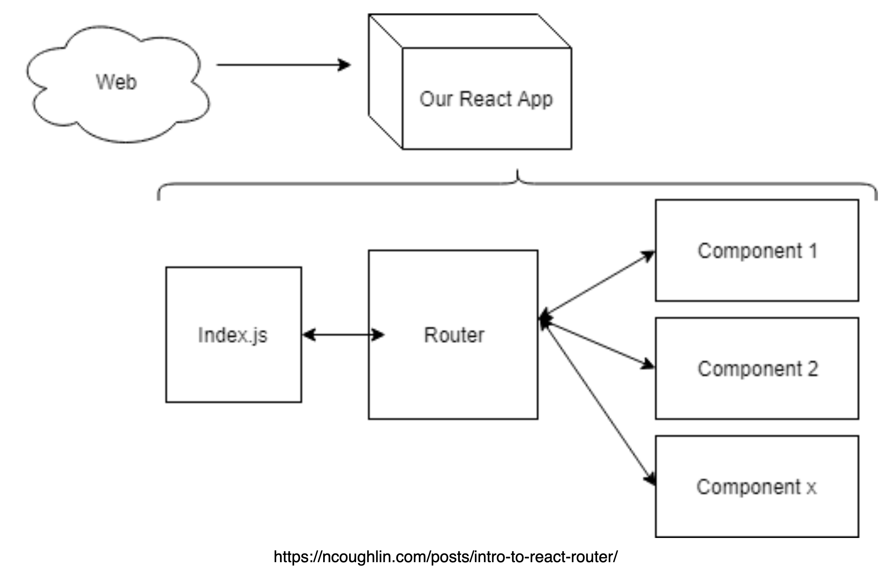
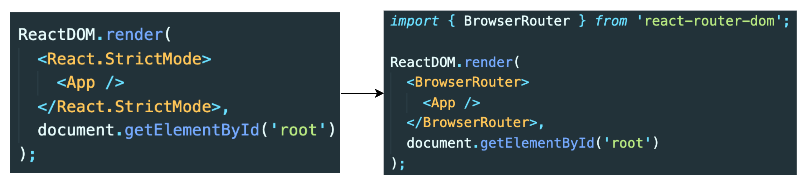
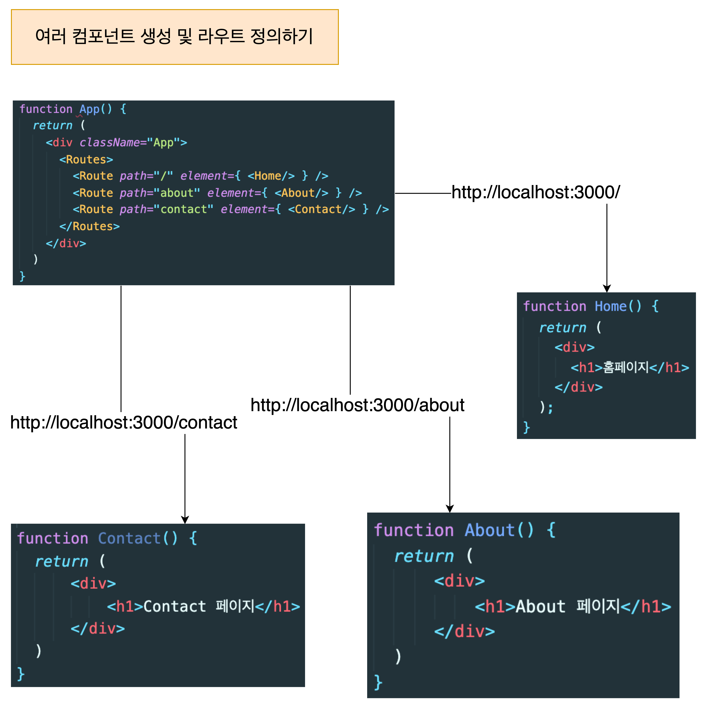
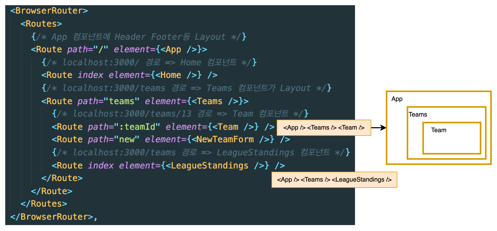
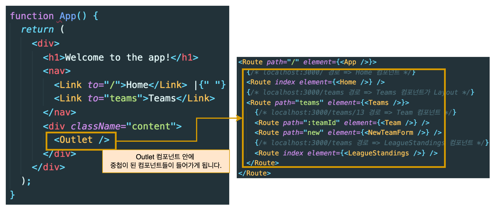
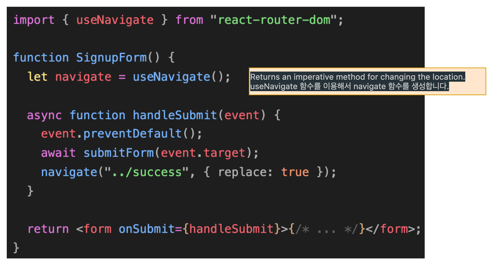
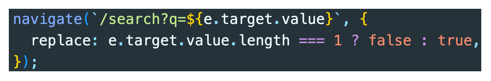
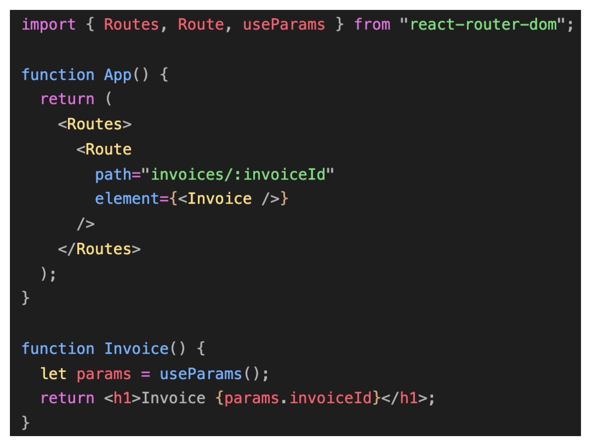
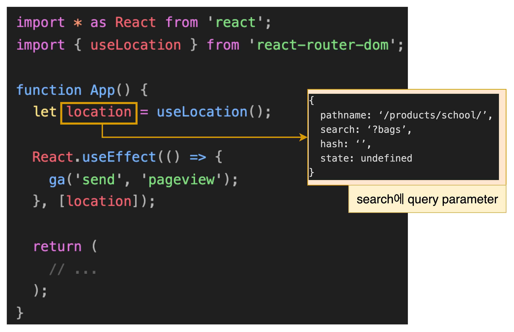
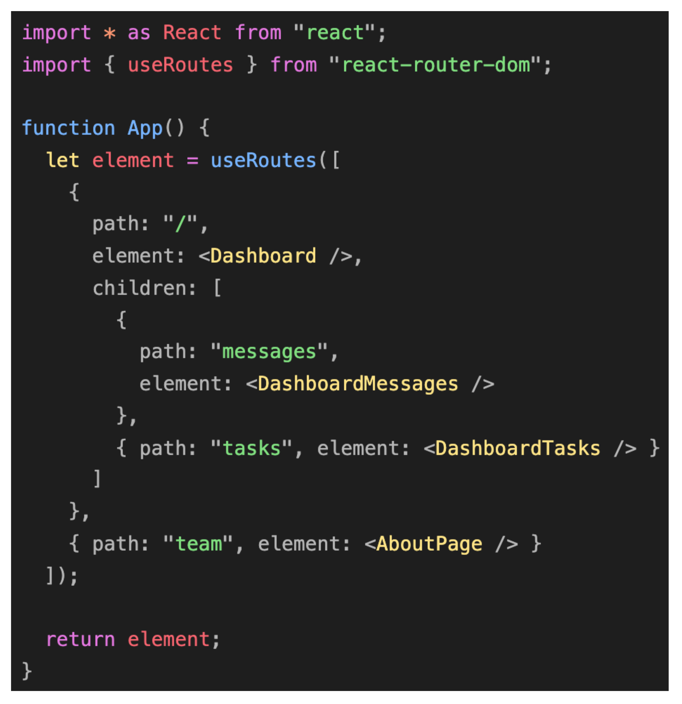

# React - Route - Dom 이란

---

**React Router DOM을 사용하면 웹 앱에서 동적 라우팅을 구현할 수 있습니다.** 라우팅이 실행 중인 앱 외부의 구성에서 처리되는 기존 라우팅 아키텍처와 달리 React Router DOM은 앱 및 플랫폼의 요구 사항에 따라 컴포넌트 기반 라우팅을 용이하게 합니다

## Single Page Application (SPA)

---

리액트는 SPA이기 때문에 하나의 index.html 템플릿 파일을 가지고 있습니다. 이 하나의 템플릿에 자바스크립트를 이용해서 다른 컴포넌트를 이 index.html 템플릿에 넣으므로 페이지를 변경해주게 됩니다. 이 때 이 React Router Dom 라이브러리가 새 컴포넌트로 라우팅/탐색을 하고 렌더링하는데 도움을 주게 됩니다.



## React Router Dom 설치하기

```bash
npm install react-router-dom --save

yarn add react-router-dom
```



## BrowserRouter

---

HTML5 History API(pushState, replaceState 및 popstate 이벤트)를 사용하여 UI를 URL과 동기화된 상태로 유지해줍니다.

<aside>
💡 **HTML5의 History API를 사용하여 페이지를 새로고침하지 않고도 주소를 변경할 수 있도록 해줍니다.**

</aside>

[History API - Web API | MDN](https://developer.mozilla.org/ko/docs/Web/API/History_API)



routes : 앱에서 생성될 모든 개별 경로에 대한 컨테이너/상위 역할을 함

routes : Route는 단일 경로를 만드는데 씁니다.두가지 속성을 취합니다

- path : 원하는 컴포넌트의 URL 경로를 지정 이경로 이름을 원하는대로 정할 수 있습니다 . 위에서 첫 번째 경로 이름이 /(백슬래시) 임을 알 수 있다. / 가 경로인 컴포넌트는 앱이 처음 로드될 때에 먼저 렌더링 됩니다.
- element : 경로에 맞게 랜더링 되어야할 컴포넌트

## **React-Route-Dom API**

---

### **중첩 라우팅(nested routing)**



이것은 **React Router**의 가장 강력한 기능 중 하나이므로 복잡한 레이아웃 코드를 어지럽힐 필요가 없습니다. 대부분의 레이아웃은 URL의 세그먼트에 연결되며 React Router는 이를 완전히 수용합니다.

### **Outlet**



자식 경로 요소를 렌더링하려면 부모 경로 요소에서 <Outlet>을 사용해야 합니다. 이렇게 하면 하위 경로가 렌더링될 때 중첩된 UI가 표시될 수 있습니다. 부모 라우트가 정확히 일치하면 자식 인덱스 라우트를 렌더링하거나 인덱스 라우트가 없으면 아무것도 렌더링하지 않습니다.

react-router-dom에서 가져와서 사용합니다.

### **useNavigate**



navigate에

replace: true를 사용하면 navigate에 적힌 주소로 넘어간 후 뒤로 가기를 하더라도 방금의 페이지로 돌아오지 않고 메인 페이지 ("/")로 돌아오게 됩니다.

false가 기본 값이며 뒤로 가기가 가능하게 됩니다.



실제 넷플릭스 사이트에 가서 검색어를 입력하면 여러 번 입력하고 뒤로 가기를 누르면

검색어 바로 뒷자리로 이동하는 게 아닌 검색을 시작하기 전 페이지로 뒤로 가게 됩니다.

그렇게 구현하기 위해서는 위에 처럼 replace 옵션을 사용해줘야 합니다.

이 소스 코드는 history를 쌓을 때 첫 번째 글자일 때만 쌓고 그다음 글자부터는 안 쌓게 합니다.

그래서 여러 글자를 쓰고 뒤로 가기를 한번 누르면 처음 글자 쓰기 전 history로 가게 됩니다.

### **useParams**

useParams Hooks는 <Route path>와 일치하는 현재 URL에서 동적 매개변수의 키/값 쌍 객체를 반환합니다.

:style 문법을 path 경로에 사용하였다면 useParams()로 읽을 수 있습니다.

아래는 :invoiceId가 무엇인지 알기위해 useParams를 사용했습니다.



### **useLocation**

이 Hooks를 이용해서 현재 URL 정보를 가져올 수 있습니다.

이 Hooks 는 현재 위치 객체를 반환합니다. 이것은 현재 위치가 변경될 때마다 일부 side effect를 수행하려는 경우에 유용할 수 있습니다.



### **useRoutes**

useRoutes Hooks는 와 <Routes>와 기능적으로 동일하지만 <Route> 요소 대신 JavaScript 객체를 사용하여 경로를 정의합니다. 이러한 객체는 일반 <Route> 요소와 동일한 속성을 갖지만 JSX가 필요하지 않습니다.


