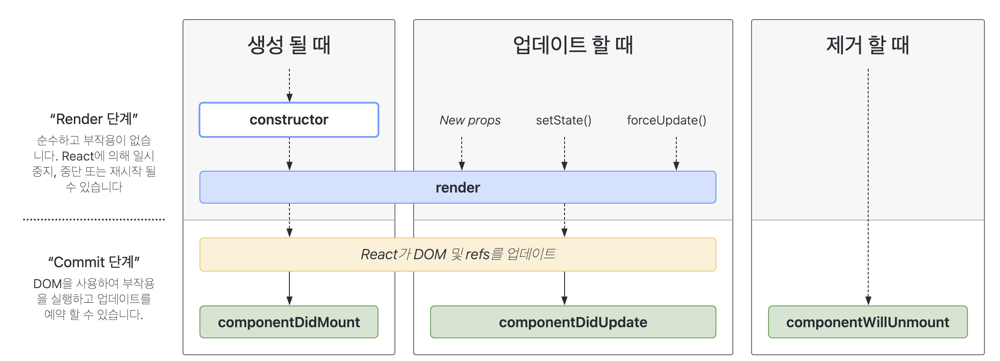

리액트 16.4v 이후

#React LifeCycle

- Lifecycle method 는 한국말로 **생명주기 메서드**라고 부른다.
- React 에서 컴포넌트의 생성, 업데이트 및 사라지는 것과 관련된 단계를 나타내는 메서드의 집합이다.
- Lifecycle 메서드들을 사용하여 컴포넌트의 동작을 제어하고 필요한 작업을 수행 할 수 있다.
  <br>
  React 생명주기는 컴포넌트가 처음 생성될 때(**Mounting Phase**), 업데이트될 때(**Updating Phase**) 및 제거될 때(**Unmounting Phase**) 각 단계를 따른다.
  각 단계에서 특정한 메서드들이 호출되며, 이를 통해 컴포넌트의 상태 변화를 감지하고 원하는 동작을 수행할 수 있다.

생명주기 다이어그램

출처 : [출처페이지](https://projects.wojtekmaj.pl/react-lifecycle-methods-diagram/)
<br>

## 생성 단계(Mounting Phase)

- 생성단계(Mounting)는 React 컴포넌트가 처음 웹 페이지에 렌더링되는 과정이다.
- 총 4가지 메서드가 있다.
- `constructor` -> `getDerivedStateFromProps` -> `render` -> `componentDidMount` 순서대로 실행되며, 이 과정을 통해 컴포넌트가 그려진다.

### 1. constructor

- 컴포넌트 클래스의 생성자 메서드.
- 컴포넌트가 만들어지면 가장먼저 실행되는 메서드
- 컴포넌트의 `state`를 초기화하는 곳

### 2. getDerivedStateFromProps

- props에서 state를 동기화하는 데 사용된다.
- 이 메서드는 props의 변화에 따라 state를 업데이트해야 할 때 사용한다.
- 이메서드는 props에 의존하는 state를 가지고 있을 때만 필요하며, 그렇지 않은 경우에는 불필요한 리렌더링을 유발할 수 있어 주의해서 사용해야한다.

### 3. render

- 컴포넌트를 렌더링한다.
- 이 메서드는 **반드시 구현**해야 하며, `null`이나 `JSX` 요소를 반환해야 한다.

### 4. componentDidMount

- 컴포넌트가 DOM에 마운트된 직후 , 첫 렌더링이 끝난 후에 호출된다.
- 이 메서드에서 비동기 요청을 수행하거나, setTimeout이나 setInterval 같은 타이머를 쓴다.

<br>

---

## 업데이트될 때(Updating Phase)

- 업데이트(Updating) 단계는 컴포넌트의 `state` 나 `props`가 변경될 때 또는 부모 컴포넌트가 리렌더링될 때 시작한다.
- `getDerivedStateFromProps` -> `shouldComponentUpdate` -> `render` -> `getSnapshotBeforeUpdate` -> `componentDidUpdate` 순서대로 실행
- 위 과정을 통해 컴포넌트의 상태가 업데이트 되고 리랜더링됨.
- `shouldComponentUpdate`, `getSnapshotBeforeUpdate`, `componentDidUpdate`
  는 선택적으로 사용할수있다.

### 1. static getDerivedStateFromProps

- 위와 동일한 메서드
- 컴포넌트가 업데이트되기 전에 호출되며, 필요한 경우 `state`를 업데이트할 있다.

### 2. shouldComponentUpdate

- 이 메서드는 컴포넌트가 리렌더링을 해야 하는지 여부를 결정한다.
- 이 메서드는 `boolean` 값을 반환하며, true를 반환하면 다음 메서드가 호출되고, false를 반환하면 이후의 업데이트 과정이 중단된다.
- 이 메서드는 **성능 최적화**를 위해 사용되며, React.PureComponent를 사용하는 경우 자동으로 구현된다.
  - 함수형 컴포넌트에서 React.memo 로사용
  - 궁금한거 못참지 **class** or **func**

#### 최적화 (shouldComponentUpdate, React.memo)

```jsx
class ExampleComponent extends React.Component {
  constructor(props) {
    super(props);
    this.state = {
      someState: "initial value",
    };
  }

  shouldComponentUpdate(nextProps, nextState) {
    // 'someProp'가 변경되었거나 'someState'가 변경되었을 때만 컴포넌트를 업데이트
    if (
      this.props.someProp !== nextProps.someProp ||
      this.state.someState !== nextState.someState
    ) {
      return true;
    }
    // 그렇지 않은 경우에는 컴포넌트 업데이트를 스킵
    return false;
  }

  render() {}
}
```

```jsx
const ExampleComponent = React.memo(
  function ExampleComponent(props) {
    // 컴포넌트 구현
  },
  (prevProps, nextProps) => {
    // shouldComponentUpdate와 비슷한 역할을 하는 함수
    // prevProps와 nextProps가 같다면 (즉, props가 업데이트되지 않았다면) 리렌더링을 방지하기 위해 true를 반환
    // props가 업데이트되었다면 (즉, prevProps와 nextProps가 다르다면) 리렌더링을 수행하기 위해 false를 반환
    return prevProps.someProp === nextProps.someProp;
  }
);
```

### 3. render

- 위와 동일
- 컴포넌트를 리렌더링하고 , 필요한 JSX를 반환한다.

### 4. getSnapshotBeforeUpdate

- 이 메서드는 DOM 업데이트가 일어나기 직전에 호출되며
- DOM 변경에 대한 정보를 캡처하거나, DOM 업데이트 전의 어떤 값들을 계산하고 저장해두었다가 나중에 필요할 때 사용하기 위해 사용될 수 있다.
- 이 메서드의 반환값은 `componentDidUpdate의` **세 번째 파라미터로 전달**된다.

### 5. componentDidUpdate

- 이 메서드는 컴포넌트가 업데이트된 후에 호출된다.
- 새 `props`나 `state`를 받아서 DOM을 업데이트한 후에 실행되며, 이 메서드에서는 DOM에 대한 연산이나, 네트워크 요청 등의 작업을 수행한다.

<br>

## 제거될 때(Unmounting Phase)

- 이 단계는 컴포넌트가 DOM에서 컴포넌트에서 나갈때(제거될 때) 호출된다.
- 언마운팅에 관련된 생명주기 메서드는 `componentWillUnmount` 하나만 존재한다.

### 1. componentWillUnmount

- 이 메서드에서는 컴포넌트가 **마운트 단계**나 **업데이트 단계**에서 설정한 **이벤트 핸들러, setTimeout, setInterval** 등의 동작을 정리(cleanup)한다. -> (메모리 누수 방지)
- 이 메서드는 컴포넌트가 화면에서 사라지기 직전에 호출되서, 이 메서드 내에서 `setState`를 호출하면 안된다. 컴포넌트는 이미 언마운팅 단계에 들어와있기 때문에, `setState`를 호출해도 `state`의 업데이트가 이루어지지 않습니다.

<br>

---

## useEffect

- React에서는 클래스 컴포넌트의 생명주기 메서드 들을 대체하기 위해 `Hooks`라는 개념을 도입했다. 빠르게 살펴보자

### 생성될 때(Mounting Phase)

- 클래스 컴포넌트의 `componentDidMount`와 비슷, `useEffect` 훅의 두 번째 인수로 빈 배열([])을 전달하여 마운트 시 동작을 핸들링할수있다.

```jsx
import React, { useEffect } from "react";

function ExampleComponent() {
  useEffect(() => {
    console.log("Component did mount");
  }, []);

  return <div>Hello, world!</div>;
}
```

### 업데이트될 때(Updating Phase)

- `componentDidUpdate` 와 비슷하게 `useEffect` 훅을 사용하여 컴포넌트가 업데이트될 때 동작을 정의할수있다.
- `useEffect의` 두 번째 인수로 전달한 배열에 변경을 감지하려는 `state`를 넣으면 해당 `state`가 변경될 때마다 `useEffect` 안의 함수가 실행된다.

```jsx
import React, { useState, useEffect } from "react";

function ExampleComponent() {
  const [count, setCount] = useState(0);

  useEffect(() => {
    console.log("Count did update");
  }, [count]);

  return <button onClick={() => setCount(count + 1)}>Count: {count}</button>;
}
```

### 제거될 때(Unmounting Phase)

- 이번에도 클래스 컴포넌트의 `componentWillUnmount` 와 유사하다, `useEffect` 훅에서 반환하는 함수를 통해 컴포넌트가 언마운트되기 전에 실행할 동작을 정의할 수 있다.
- `return` 안에 콜백함수 형태로 반환 하는것을 `cleanup` 함수라 한다.

```jsx
import React, { useEffect } from "react";

function ExampleComponent() {
  useEffect(() => {
    return () => {
      console.log("Component will unmount");
    };
  }, []);

  return <div>Goodbye, world!</div>;
}
```

## 정리

- 리액트의 컴포넌트 생명주기 3단계

  - 순차적으로 실행됨
  - 생성(Mounting)
    - `constructor`
    - `getDerivedStateFromProps`
    - `render`
    - `componentDidMount`
  - 업데이트(Updating)
    - `getDerivedStateFromProps`
    - `shouldComponentUpdate`
    - `render`
    - `getSnapshotBeforeUpdate`
    - `componentDidUpdate`
  - 제거(Unmounting)
    - `componentWillUnmount`

- 리액트 `Hooks`의 `useEffect`를 통한 메서드 사용법
- 간단한 생명주기
  

---

다음은 이번글에서 미쳐 정리못한 메서들의 사용법 혹은 `Hook` 을 알아보려한다
