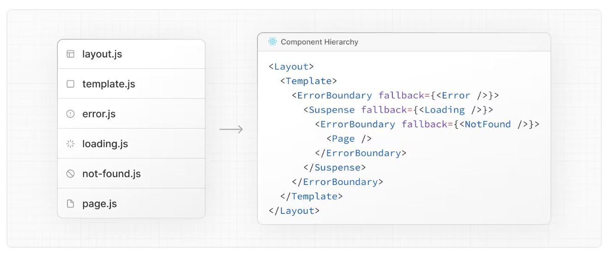
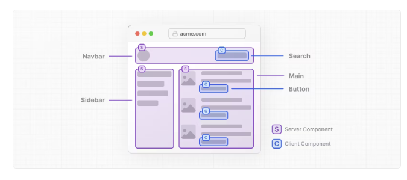

# Nextjs 구성

## Routing

nextjs 의 라우팅은 기본적으로 폴더구조로 라우팅을 정한다.
13버전을 기준으로 12버전아래로는 `Page` 폴더 기반 라우팅이 되고
13버전 위로 `app` 폴더를 기준으로 라우팅이 만들어진다.

`app` 라우팅을 기준으로 프로젝트를 설계하려한다.
몇가지 라우팅을 짚고 가보기전에 app기반 폴더구조로 바뀌고나서 개선사항에 대해서 알아보자

nextjs [공식문서 블로그](https://nextjs.org/blog/next-13-1#improved-stability-and-support-for-app-directory)에가보면 app 기반 폴더 구조 page폴더 구조보다 좋아진점을 몇가지알수있따.

| Item                | Change |  Percentage   |
| ------------------- | :----: | :-----------: |
| Total First Load JS | -9.3kB | 12.1% smaller |
| Next.js Runtime     | -12kB  | 56.8% smaller |
| React Runtime       | +2.7kB |  5.2% larger  |

page폴더보다 퍼포먼스 지표가 더 높아진걸 볼수있다.
<br>

### 라우팅

기본 적으로 app 라우팅 내부 파일들은 **서버 컴포넌트로 구성이된다** 즉 nodejs 환경으로 돌아간다는 뜻

기본적으로 app 폴더안에 `page.tsx` , `layout.tsx` 가 있고 이 파일들이 기본 index.html 역할을 한다. 예시로 nextjs를 생성해보면 layout.tsx안에 html구조가 들어간것을 볼수있다.

app 폴더 내부에는
`layout.tsx`
`page.tsx`
`loading.tsx`
`not-found.tsx`
`error.tsx`
`global-error.tsx`
`route.ts`
`template.tsx`
`default.tsx`

이 파일들이 들어가며 위의 파일들의 구조는

이러한 형태로 나타난다. 이 구조를 살펴보면 Layout과 Template는 기본적 골격으로 다른것들을 감싸고있다,

중요하게 볼것은 Suspense 태그인데 서버에서 랜딩 `Page`를 내보내기위해 Suspense태그를 통해 안정적으로 내보내는 것으로 보여진다.

Nextjs 의 강점중 하나라고 생각한다.

## Server Component

Nextjs의 강점중 또하나인 Server Component는 React 18 버전이후에 Suspense태그와 같이 나온 기능중 하나이다. (~~Nextjs 때문에 나온거같다고 착각할정도~~)

`app`폴더 내에있는 파일들은 전부 서버컴포넌트로서 작동을 하는데에 상단에 'use client' 라고 명시를 해주면 클라이언트서버로 작동을한다.

nextjs가 버전 13으로 넘어 오면서 가장 큰변화였는데 기존에는 page폴더안에 파일들을
클라이언트 컴포넌트로서 생성이되고 getStaticProps getServerProps 으로 데이터들을 가져와 서버사이드에서 미리 랜더를 시키고 뿌려주는 역할을 수행했다면

app 라우터에서는 기본적으로 서버사이드컴포넌트에서 데이터들을 패치하고 가져와 랜더에
뿌려줄수 있게되었다.

이렇게 발전함에 따라서 컴포넌트 단위의 서버사이드 랜더링이 가능하게 되었는데 문서를
잠시 살펴보면 아래 예시와 같다.


전체적인 Navbar구조에서는 서버사이드에서 랜더링을하고 Search 컴포넌트는 클라이언트
컴포넌트로서 역할을 수행한다.

sidebar 는 전체적으로 서버사이드랜더링이 수행이 되고
Main 컴포넌트에서는 item 컴포넌트또한 서버사이드랜더링이 수행되지만 item 안에있는
Button 컴포넌트는 클라이언트 컴포넌트로서 수행을 한다.

아마 컴포넌트 구조는 이렇게 되지않을까싶다.

```tsx
<>
  <Navbar />
  <Wrraper>
    <Sidebar />
    <Main />
  </Wrraper>
</>
```

page.tsx안에 이렇게 서버컴포넌트로서 구성이되고
Main.tsx 컴포넌트는 서버컴포넌트로서

```tsx
///main.tsx
{
  list?.map((item) => <Item />);
}
```

Item.tsx 에는 'use client'가 명시된 Button 컴포넌트가 들어가있을것이다.

```tsx
/// item.tsx
<>
  // image // content 등
  <Button />
</>
```

이러한 장점은 엄청나게 다가오지만 생각할것이 많아졌다는 것또한 단점으로 볼수있다.

서버 컴포넌트에서는 리액트의 큰장점인 Hooks 패턴사용이 힘들다는 점이다.
동적으로 랜더를 하기위해서 Hooks패턴을 사용해 자유롭게 사용자인터렉션에 대응하는것이
리액트의 큰 장점중 하나였는데 이러한 부분을 고민을 많이해서 코드를 작성해야하고 폴더구조를 깊게 고민해야하는 점이 크게 다가왔다.

하지만 이러한고민은 구글 라이트하우스 점수앞에서 무릎꿇게 되었다.

조금만 고민을 잘해서 ISR SSR SSG CSR을 적절히 섞고 metaTag를 최적화해 웹앱을 만들어 라이트하우스 점수를 보면 미소를 안지을수 없었다.
