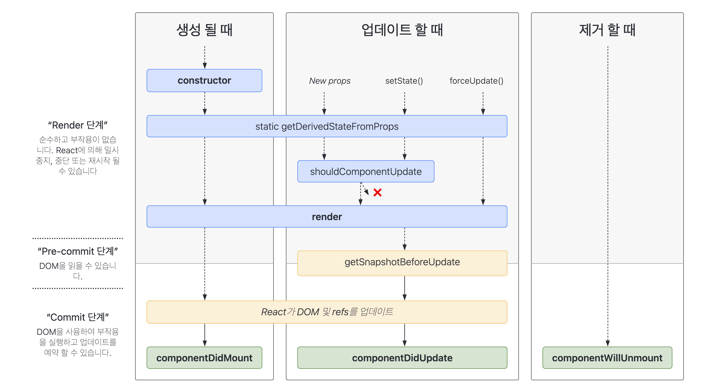

- [React: State, Props 및 Re-rendering에 대해](#react-state-props-및-re-rendering에-대해)
  - [React의 컴포넌트 모델](#react의-컴포넌트-모델)
    - [함수형 컴포넌트](#함수형-컴포넌트)
    - [컴포넌트 라이프 사이클](#컴포넌트-라이프-사이클)
  - [State](#state)
    - [State란](#state란)
    - [State 생성 및 초기화](#state-생성-및-초기화)
  - [Props](#props)
    - [예시](#예시)
    - [props state 차이](#props-state-차이)
  - [Re-rendering](#re-rendering)
    - [Re-rendering이란?](#re-rendering이란)
  - [고오오오오급 패턴에 대해 알아보자](#고오오오오급-패턴에-대해-알아보자)
    - [Hooks (useState, useEffect 등)](#hooks-usestate-useeffect-등)
    - [Custom Hooks](#custom-hooks)
    - [Higher Order Components (HOC)](#higher-order-components-hoc)
    - [Render Props](#render-props)

# React: State, Props 및 Re-rendering에 대해

내가 알고있는 State와 Props 및 re-render에대해 기술하려고한다.
얇게 알고 있는만큼 정리하면 그 얇은 지식이라도 완전히 습득하길 기대하면서

## React의 컴포넌트 모델

### 함수형 컴포넌트

함수형 컴포넌트는 react에서 주로 사용하는 컴포넌트 모델
자바 스크립트 함수를 사용

```tsx
const 함수Component: React.FC<propsType> = (props) => {
  retrun(<>나는야 함수고 옆에는 프롭{props.item}</>);
};
```

이놈은 클래스

```tsx
class 클래스Component extends React.Component<PropsType> {
  render() {
    return <h1>Hello, {this.props.name}</h1>;
  }
}
```

### 컴포넌트 라이프 사이클

[라이프사이클](../ReactLifeCycle/README.md)요기에서도 언급했던바 사진한장으로 대체


## State

### State란

React의 State는 컴포넌트에서 관리하는 데이터를 의미

### State 생성 및 초기화

React 에서 함수형, 클래스형 각각 state를 생성과 초기화가 틀리다
아래요약

클래스형

```tsx
class 클래스Component extends React.Component<{}, StateType> {
  constructor(props: {}) {
    super(props);
    this.state = { name: "쵠석" };
  }
  this.setState({ name: '최은석' }); 업데이트방법

  render() {
    return <h1>h 1 ~, {this.state.name}</h1>;
  }
}
```

```tsx
import React, { useState } from "react";

const 함수형Component: React.FC = () => {
  const [name, setName] = useState<string>("쵠석");
  setName("최은석");

  return <h1>Hello, {name}</h1>;
};
```

리액의 setState 비동기이기때문에 새배열 새로운 함수로받은값 등을 사용하는게 안전쓰

자세한내용은 [useState](../useState/README.md)

## Props

React 컴포넌트는 prop을 입력받을수 있다.
객체로 전달되고 함수 파라미터처럼 컴포넌트 함수에 전달된다.

### 예시

요로코롬 사용하면됨

```tsx
// 함수형 컴포넌트
const 함수컴포: React.FC<PropsType> = (props) => {
  return <div>떫, {props.name}</div>; //쵠석
};

// 클래스 컴포넌트
class 클래스컴포 extends React.Component<PropsType> {
  render() {
    return <div>떫, {this.props.name}</div>;
  }
}

// 사용 예시
function App() {
  return <함수컴포 name="쵠석" />;
}
```

### props state 차이

- Props와 state는 모두 순수 JavaScript 객체다
- 둘 다 렌더링에 영향이 있다.
- props 부모컴포에서 자식컴포에서 주는값이고 읽기만 가능. 반대로 state는 컴포넌트 내부에서 생성,변경가능하다
- js안의 함수의 매개변수 , 선언된 변수 각각 props 와 state와 비슷하다.
- React의 state는 비동기적으로 업데이트된다. 이 업데이트가 발생하면 컴포넌트는 리렌더링된다. 그리고 props는 상위 컴포넌트가 변경하거나 자식 컴포넌트가 새로 렌더링될 때 변경된다.
  - 컴포넌트가 시간이 지나면서 변경될 수 있는 데이터를 가지고 있다면 state를 사용하고
  - 부모로부터 주어진 데이터를 단순히 표시하는 경우에는 props를 사용한다.
- 그리고 props는 **얕은복사로만 자식컴포넌트로 전달된다**. (객체의 최상위 레벨만 복사)
  - 만약 깊은복사로 수행되면 추가적인 성능비용을 발생시킬수도 있기때문
  - 따라서 자식컴포넌트로 전달된 예)props.item.name.firstName 이처럼 firstName의 값이 달라지면 원본도 완전히 바뀐다는 뜻이다. (원본객체도 바뀐다는뜻)
    그리고 위는 React Props 의 읽기전용이라는 원칙에 위배되므로 반드시 피하자

## Re-rendering

### Re-rendering이란?

[Rerendering - 컴포넌트최적화](../%EC%BB%B4%ED%8F%AC%EB%84%8C%ED%8A%B8%EC%B5%9C%EC%A0%81%ED%99%94/README.md)

React의 컴포넌트에서 Re-rendering은 컴포넌트의 state나 props가 변경되었을 때 해당 컴포넌트가 다시 랜더되는과정이다.
이때, React는 이전과 다음 상태를 비교하여 실제로 변경된 부분만 업데이트한다.

Re-rendering을 일으키는 요인

- 컴포넌트의 state가 변경되었을 때
- 컴포넌트의 props가 변경되었을 때
- 부모 컴포넌트가 re-render될 때
- Context 값이 변경되었을 때
- forceUpdate 함수가 호출되었을 때

## 고오오오오급 패턴에 대해 알아보자

자 React에서 자주 사용되는 state와 prop에 관한 고오오급 패턴에 대해서 알아보자

### Hooks (useState, useEffect 등)

흔히 알고있는 기능도 고오오급 패턴중 일부

```tsx
import React, { useState, useEffect } from "react";

const Counter: React.FC = () => {
  const [count, setCount] = useState(0);

  useEffect(() => {
    document.title = `Count: ${count}`;
  }, [count]);

  return (
    <div>
      <p>You clicked {count} times</p>
      <button onClick={() => setCount(count + 1)}>Click me</button>
    </div>
  );
};
```

### Custom Hooks

개발자가 정의한 특별한 훅!

알다시피 React의 기본 훅들로 보통 구성되어있고
재사용성이 용이하게 만들어지는게 보통이다.

```tsx
import React, { useState, useEffect } from "react";

const useCounter = (initialCount: number = 0) => {
  const [count, setCount] = useState(initialCount);

  useEffect(() => {
    document.title = `Count: ${count}`;
  }, [count]);

  const increment = () => {
    setCount(count + 1);
  };

  return { count, increment };
};

const Counter: React.FC = () => {
  const { count, increment } = useCounter(0);

  return (
    <div>
      <p> {count} 번</p>
      <button onClick={increment}>업업업</button>
    </div>
  );
};
```

### Higher Order Components (HOC)

- 컴포넌트를 가져와서 새 컴포넌트를 반환하는 함수.

  - 이 패턴을 사용하면 컴포넌트 로직을 재사용하고 공유할 수 있다.
  - 예시는 로그인 여부에 따라 다른 화면을 보여주는 경우
  - HOC는 추가적인 렌더링을 도입하여 성능에 약간의 영향을 미칠 수 있다 하지만 감당가능한정도

```tsx
import React from "react";
import { Redirect } from "react-router-dom";

const withAuth =
  <P extends object>(Component: React.ComponentType<P>): React.FC<P> =>
  (props: P) => {
    const isLoggin = checkIfUserIsLoggin(); // 로그인 확인 함수

    return isLoggin ? (
      <Component {...props} /> // 로그인이 되어있으면 원래 컴포넌트 반환
    ) : (
      <Redirect to="/login" />
    ); // 로그인이 되어있지 않으면 로그인 페이지로 리다이렉트
  };

// 사용 예
const Dashboard = withAuth(DashboardPage);
```

### Render Props

- Render Props는 함수형 자식 또는 자식을 함수로 사용하여 컴포넌트의 로직을 공유하는 React 패턴
  - 예는 react router가 Route가 이러한 구조

```tsx
import React, { useState, useEffect } from "react";

interface TimeProviderProps {
  children: (time: Date) => React.ReactNode;
}

const TimeProvider: React.FC<TimeProviderProps> = ({ children }) => {
  const [time, setTime] = useState<Date>(new Date());

  useEffect(() => {
    const timer = setInterval(() => setTime(new Date()), 1000);
    return () => clearInterval(timer);
  }, []);

  return <>{children(time)}</>;
};

// 사용 예
<TimeProvider>
  {(time) => <div>현재 시간: {time.toLocaleTimeString()}</div>}
</TimeProvider>;
```

이상 이번주 WIL 정리할겸 TIL로 정리한것을 다시 생각해보면서 정리했다.
