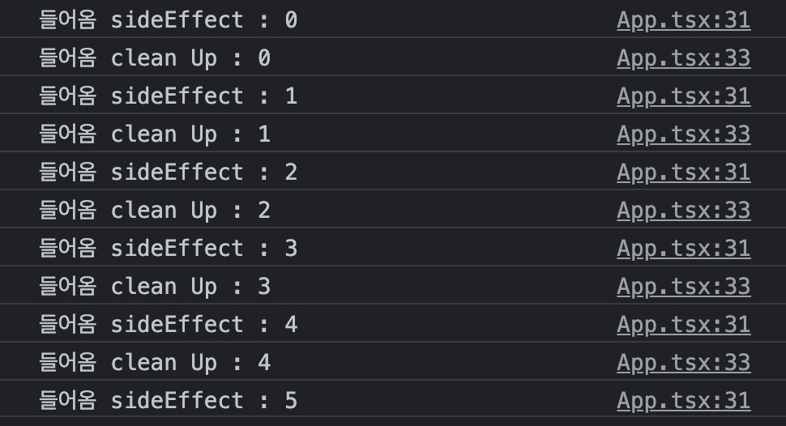

# UseEffect hook

오늘 같이 공부하는 스터디원과 공부를 같이하다가 알아낸게 있어 기록한다.

useEffect의 의존성 배열이 한개이상일때에 인자값이 바뀌면

useEffect내에서 두가지를 수행한다.

첫째는 이전 useEffect의 return ()=> {} 즉 `clean up 함수`를 실행한다.
두번째로 의존성배열에 담겨있는 바뀐state로 인해 새로운 useEffect의 sideEffect를 수행한다.

```tsx
const [countOne, setCountOne] = useState<number>(0);
const [countTwo, setCountTwo] = useState<number>(0);

useEffect(() => {
  console.log("들어옴 sideEffect " + countOne);
  return () => {
    console.log("들어옴 clean Up : " + countOne);
  };
}, [countOne, countTwo]);
```



이렇게 들어온다

그리고

```tsx
const [countOne, setCountOne] = useState<number>(0);
const [countTwo, setCountTwo] = useState<number>(0);

useEffect(() => {
  const ChangeValue = () => {
    setValue();
  };
  ChangeValue();
}, [countOne, countTwo]);
```

이렇게 작성된 useEffect 안에서 선언된 함수는 의존성배열 안에 있는 값이 변경될때마다
**값이 재참조되어** 즉 함수가 새로 생성되어 메모리가 낭비될수도 있다,
이때에는 useEffect내부말고 외부에서 함수를 한번만 선언하거나 `useMemo`나 `useCallback`을 이용해서
재생성을 방지하자

정리

1. 의존성 배열안의 값이 한개 이상일때에 그 값들 혹은 그값이 달라질때에 이전의 `clean up`함수를 실행한다. 그후에 값이 달라진 값을 가지고 useEffect 콜백함수를 실행한다.
2. useEffect 의존성배열안에 값이 있을경우 내부에 함수를 선언된 함수는 값이 변경될때마다 재생성되어 메모리효울이 좋지않다. 외부에 선언하자.
