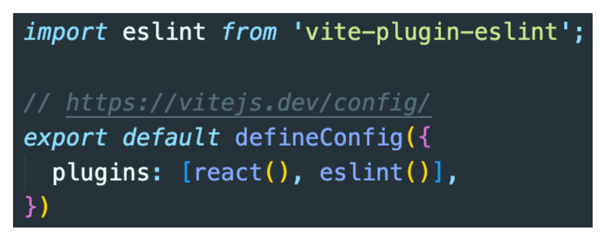
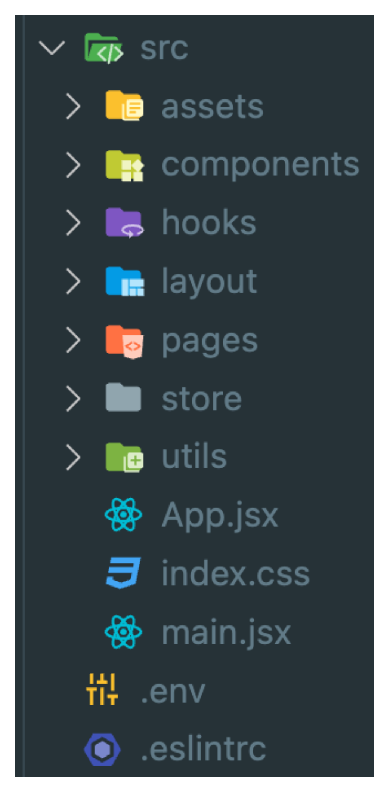

# 리액트 페이지네이션 기능 구현

## 개요

각각의 리액트를 다루는 폼이나 자주쓰는 기능을 단시간내에 구현하는것을 연습하여 로직이나 훅을 통한 기능 구현 을 친숙화하는것을 목표로 시작

## 스터디원🤔

---

<div style="display:inline-block;text-align:center">
    <a href="https://github.com/nonjk2">
        
        <br/>
        스터디원 1
    </a>
</div>
<!-- <a href="https://github.com/khu107" >
    
</a>
<a href="https://github.com/soolovepat" >
    
</a>
<a href="https://github.com/miinxxi" >
    
</a> -->

---

## 규칙

1. vite로 react 생성

```shell
npm init vite
```

<br>
2. CSS 프레임워크 (스타일) 자유

- [x] styled-components
- [ ] Emotion
- [x] Styled-jsx
- [ ] Material-UI
- [ ] tailwind CSS

```shell
npm install react-router-dom styled-components
```

3. TypeScript

- 하면 좋지만 안하는거 추천 끝나고 풀리퀘 코드리뷰할껀데 서로 보기 불편함
- tsconfig 설정 본인이 알아서

```shell
npm install @types/styled-components
```

4. eslint

```shell
npm install -D vite-plugin-eslint eslint eslint-config-react-app
```


<br>
.eslintrc
대충 본인이 커스텀

```shell
{
  "env": { "browser": true, "es2020": true },
  "extends": [
    "eslint:recommended",
    // "plugin:@typescript-eslint/recommended",
    "plugin:react-hooks/recommended"
  ],
  // "parser": "@typescript-eslint/parser",
  "parserOptions": { "ecmaVersion": "latest", "sourceType": "module" },
  "plugins": ["react-refresh"],
  "rules": {
    "react-refresh/only-export-components": "warn"
  }
}

```

5. 폴더구조
   

6. 리덕스 사용

- 하면 좋음
- 안해도 좋음
- contextAPI 가능

7.
