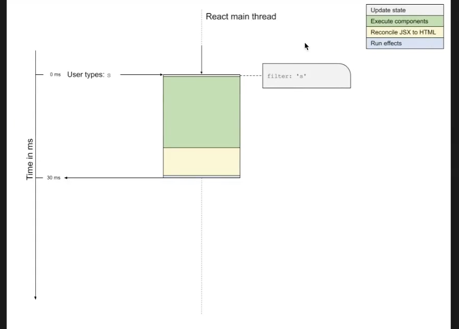

# 랜더링

React rendering 동작방식

1. React 성능
   - React 성능을 좋아보이게 하기 위해서 사용자경험이 우선시 되야한다. LightHouse점수가 아무리 높아도 랜더링의 조금이라도 불편함이있으면 사용자가 성능이 안좋다고 판단해버리기때문
   - 현실적인 성능 : 리액트는 아무래도 단일 스레드 환경으로 이루어져 있기때문에 그만큼 성능 관리에 신중해야한다.
   - 성능을 결정짓는것
     - 로딩
     - 이미지 로드(리사이징 최적화 , wepp등 ),
     - 랜더링 성능
     - 코드 스플리팅 (코드 모듈화)

## Thread

- 실행흐름의 최소 단위 예) 카카오톡을 실행 시켰을 때
  - 메세지를 전송하는 역할을 맡은 녀석
  - 메세지를 수신하는 역할을 맡은 녀석
  - 계속해서 화면을 업데이트하는 녀석

리액트는 싱글 스레드 환경에서 돌아감



1. 사용자 입력 받아서 상태 업데이트
2. render() 함수실행
3. Reconcile 과정수행 (돔트리 버츄얼돔 비교)
4. 등록된 effect 실행

2번에서 3번 과정에서 엄청나게 많은 시간이 소요됨.

## Automatic batching

불필요한 랜더링을 막아주는 기능

리액트 18부터 나온기능이다

```jsx
import { useState } from "react";

function Counter() {
  const [count, setCount] = useState(0);

  function increase() {
    // 아래의 작업은 모두 일괄적으로 묶여 처리된다. 한 번의 리렌더링만 발생한다.
    setCount((prev) => prev + 1);
    setCount((prev) => prev + 1);
    setCount((prev) => prev + 1);
  }

  return (
    <div>
      <button onClick={increase}>+1</button>
      <p>Count : {count}</p>
    </div>
  );
}

export default Counter;
```

위의 코드를 보면 setCount에 의해 리랜더링이 총 3번 발생해야되지만 리랜더링은 한번만 발생함

React18 이전에는 state update에 한에서만 이러한 점이 가능했지만 18버전 이후에는 달라짐

```jsx
function handleClick() {
  fetch().then(() => {
    setCount((c) => c + 1); // 리렌더링 유발
    setSome((f) => !f); // 리렌더링 유발
  });
}
```

17버전에서는 리렌더링 유발했던것이 이제는 promise callback 등에도 batching을 해줌

하지만 경우에따라서 한번에 batching을 시키면 안되는 state가 있을때에는 flushSync를 써서 batching을 무시할수도 있다 .

```jsx
import { flushSync } from "react-dom";

function handleClick() {
  flushSync(() => {
    setCounter((c) => c + 1);
  });
  flushSync(() => {
    setFlag((f) => !f);
  });
}
```

## Throttle , Debounce

Throttle 사용 예

- 스크롤 이벤트 처리
- 브라우저 창에따른 리사이징 처리할때 (코드실행이 많아질때에)
- 검색어 호출할때에 github는 throttle로 처리함
- API 호출이 많이 있을때에 Throttle을 씀
- 일정한 간격으로 애니메이션을 수행할때에

Debounce 사용 예

- 검색 자동완성 검색어를 입력할때마다 API 호출을 마지막에만 딱 한번 호출하기위해 씀
- 스크롤 이벤트 : 스로틀과는 사용목적이 약간 다르지만 결과가 필요할때에
- 인피니티 스크롤
- 버튼같은것을 막 누를때에(악질 사용자 예방)
