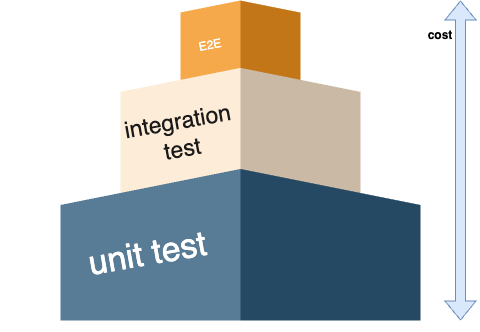

# TDD-FE

기존에는 개발후에 -> QA -> 그다음에 제품으로 나아가는데 이과정에서는 QA에서의 시간과 비용이 많이 들었었다. 그래서 개발 -> QA -> 개발 -> QA ... -> 제품으로 하였는데 TDD를 도입하면 개발하면서 해당하는 기능에대한 테스트를 작성하기때문에 많은양의 코드를 테스트를 검증할수있다.

## 테스트 피라미드

1. **Unit test**
   - 함수 , 모듈 , 클래스를 테스트
   - 자동차로 예를 들었을때 바퀴하나를 테스트하는것
2. **Integration Test**
   - 통합테스트라고도함
   - 모듈들 , 클래스들
   - 자동차를 예로 들었을때에 바퀴들을 연결했을때에 바퀴들이 서로 맞물려서 잘돌아가는것을 테스트
3. **E2E Test** (end-to-end)
   - UI 테스트 , 사용자테스트
   - 자동차를 예로 자동차가 잘 돌아가는지 테스트
4. **Cost**
   - 그림과 같이 개발 효율성과 가성비가 Unit test가 훨씬좋음
   - 반대로 E2E 테스트는 비쌈

## 테스트 코드 작성 시점

좀더 심화로 들어가서 언제 테스트 코드를 작성해야할까

1. **코드를 작성하기 전에 테스트 코드를 먼저 작성한다**.

TDD의 핵심 원칙은 "Red-Green-Refactor" 주기이다. 실패하는 테스트를 작성한 후에 코드를 작성하여 테스트를 통과시키고, 이후에 리팩터링을 수행한다.

2. **기능이나 모듈을 추가하기 전에 테스트 코드를 작성한다**.

새로운 기능이나 모듈을 추가할 때는 해당 기능에 대한 테스트를 먼저 작성한다. 이렇게 함으로써 새로운 코드가 기존 코드와 어떻게 상호작용해야 하는지 명확하게 정의할 수 있다.

1. **기존 코드를 변경하기 전에 테스트 코드를 작성한다**.

기존 코드를 수정할 때도 테스트 코드를 작성하여 기존 동작이 유지되는지 확인하고, 변경 사항이 예상대로 동작하는지 검증한다.

## CI/CD 와의 TDD의 상관관계

CI/CD에서 가장 중요하게 가정하고 있는것중하나가 **테스트코드가 있다는것**

### 1. **테스트 코드의 중요성**

- **TDD 관점에서:**

  - TDD는 테스트 코드를 개발 코드와 함께 작성하고 이를 통해 개발을 진행한다. 테스트 코드는 요구 사항을 정의하고 기능을 검증하는 중요한 역할을 한다.
  - 테스트 코드의 작성은 코드의 안정성과 신뢰성을 높이며, 변경 사항에 따른 부작용을 최소화한다.

- **CI/CD 관점에서:**
  - CI/CD는 지속적인 통합을 통해 코드베이스의 변경 사항을 지속적으로 통합하고 빌드하는 것을 목표로 한다.
  - 테스트 코드가 있는 경우 CI/CD 파이프라인은 새로운 코드가 기존 코드와 상호작용하는 방식을 검증하고 통합하는 데 도움을 줌.

### 2. **CI/CD 파이프라인에서의 테스트 활용**

- **TDD 관점에서:**

  - TDD에서는 코드 작성 전에 테스트를 작성하고, 이 테스트가 통과하도록 코드를 작성한다.
  - 테스트가 통과하면 개발자는 해당 변경 사항을 안전하게 커밋할 수 있다.

- **CI/CD 관점에서:**
  - CI/CD 파이프라인에서는 자동화된 테스트가 실행되어 변경된 코드의 품질을 확인한다.
  - 테스트를 통과하지 못한 코드는 빌드되지 않거나 배포되지 않으므로, 불안정한 코드가 프로덕션에 배포되는 것을 방지한다.

### 3. **자동화된 빌드, 테스트, 배포**

- **TDD 관점에서:**

  - TDD는 자동화된 테스트를 강조하며, 이를 통해 변경 사항이 코드 베이스에 통합될 때마다 테스트가 실행된다.

- **CI/CD 관점에서:**
  - CI/CD는 자동화된 빌드, 테스트, 배포를 지향한다. 변경 사항이 감지되면 자동으로 통합 및 테스트가 진행되고, 테스트를 통과한 경우 자동으로 배포될 수 있다.

## 결론

TDD와 CI/CD는 소프트웨어 개발에서 품질 향상과 빠른 전달을 위한 핵심 원칙들을 제공한다. 테스트 코드의 작성과 자동화된 테스트는 CI/CD의 핵심 요소로, 더 안정적이고 신뢰성 높은 소프트웨어를 지속적으로 제공하는 데 기여한다. 따라서 TDD를 통해 테스트 코드 작성을 강조하고, CI/CD를 통해 자동화된 통합, 테스트, 배포를 구현하는 것이 효과적인 개발 방법론입니다.
