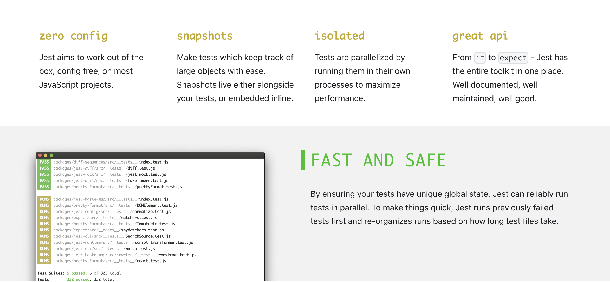

# Unit Test

테스트 코드를 수행하는 역할을 하는것을 **Test Runner** 라고 하고 실제로 TestCode 안에서 이것이 참인지 거짓인지 비교하는것이 **Assertion** 이라고 한다.

Test Runner 대표적인 라이브러리는 `Mocha`, **Assertion** 을 위한 라이브러리는 `Chai` , `expect.js` , `better-assert`가 있었으나 요즘에는 따로 별도로 구분하지않고 `jest`라는 라이브러리가 **Test Runner**와 **Assertion** 모두 통합되어지원을해서 `jest`라이브러리를 쓰면됨

## Jest


jest 공식문서에 가보면 jest의 장점들을 소개하는 페이지가있다. 살펴보자 (번역)

> 1.  제로 구성 (Zero Config)
>     해석: Jest는 프로젝트에서 별도의 구성 없이도 동작하도록 목표로 합니다. 따라서 별도의 설정이나 구성 파일 없이 간단한 명령어로 테스트를 수행할 수 있습니다.
>
> 2.  스냅샷 (Snapshots)
>     해석: Jest는 대규모 객체를 쉽게 추적할 수 있는 스냅샷을 제공합니다. 이러한 스냅샷은 테스트와 함께 위치하거나 인라인으로 내장될 수 있습니다. 스냅샷은 테스트 결과를 저장하고 추적하여 변경사항을 쉽게 확인할 수 있도록 도와줍니다.
>
> 3.  격리된 테스트 (Isolated Tests)
>     해석: Jest는 테스트를 자체 프로세스에서 병렬로 실행하여 성능을 극대화합니다. 각 테스트는 고유한 전역 상태를 보장하여 안전하게 병렬로 실행할 수 있습니다.
>
> 4.  훌륭한 API
>     해석: Jest는 it부터 expect까지 테스트에 필요한 모든 도구를 하나의 장소에 제공합니다. 잘 문서화되어 있고 유지보수가 잘 되어 있습니다.
>
> 5.  빠르고 안전한 테스트 (Fast and Safe Testing)
>     해석: Jest는 각 테스트가 고유한 전역 상태를 가지도록하여 신뢰성 있게 테스트를 병렬로 실행할 수 있습니다. 빠르게 테스트를 수행하기 위해 이전에 실패한 테스트를 먼저 실행하고 테스트 파일의 실행 시간을 기반으로 실행 순서를 조정합니다.

## 실습

[jest공식문서](https://jestjs.io/docs/getting-started)

```bash
npm install jest -g
```

```bash
The following questions will help Jest to create a suitable configuration for your project

✔ Would you like to use Jest when running "test" script in "package.json"? … yes
✔ Would you like to use Typescript for the configuration file? … no
✔ Choose the test environment that will be used for testing › node
✔ Do you want Jest to add coverage reports? … yes
✔ Which provider should be used to instrument code for coverage? › v8
✔ Automatically clear mock calls, instances, contexts and results before every test? … yes
```

```bash
npm i -D @types/jest
```

타입안뜰시 root 폴더에 jsconfig.json 생성 후 넣기

```json
{
  "typeAcquisition": {
    "include": ["jest"]
  }
}
```

1. test폴더안에 add.test.js 파일을 생성

```js
const add = require("../add.js");

test("테스트", () => {
  expect(add(1, 2)).toBe(3);
});
```

간단한 테스트 로직 작성후

2. 테스트 실행

```bash
npm run test
```

```bash

> unittest@1.0.0 test
> jest

 PASS  src/test/add.test.js
  ✓ 테스트 (1 ms)

----------|---------|----------|---------|---------|-------------------
File      | % Stmts | % Branch | % Funcs | % Lines | Uncovered Line #s
----------|---------|----------|---------|---------|-------------------
All files |     100 |      100 |     100 |     100 |
 add.js   |     100 |      100 |     100 |     100 |
----------|---------|----------|---------|---------|-------------------
Test Suites: 1 passed, 1 total
Tests:       1 passed, 1 total
Snapshots:   0 total
Time:        0.271 s, estimated 1 s
Ran all test suites.
```

### 설정

1. jest.config.js 커버리지 비활성화 설정 : jest.config.js안에 `collectcoverage` 옵션 `false`
2. 안정화된 테스트코드 실행 제외하기 : package.json 안에 jest 실행 뒤에 --watchAll 말고 --watch 붙이고 테스트안정화된 파일 `커밋` or `stash`
