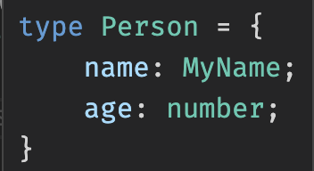
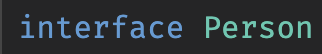
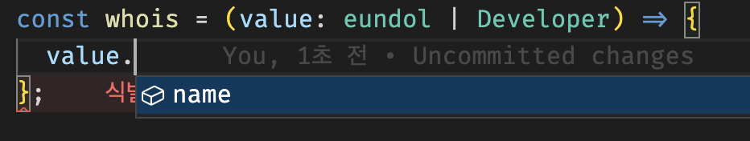
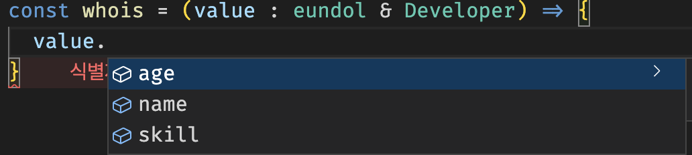

# 타입스크립트란 ?

---

타입스크립트는 자바스크립트에 타입을 부여한 언어입니다. 자바스크립트의 확장된 언어라고 볼 수 있습니다. 타입스크립트는 자바스크립트와 달리 브라우저에서 실행하려면 파일을 한번 변환해주어야 합니다. 이 변환 과정을 우리는 **컴파일(complile)** 이라고 부릅니다.

## **왜 타입스크립트를 써야할까요?**

---

자바스크립트도 충분히 복잡하고 어려운데 왜 또 다른 언어를 배워야 할까요? 단지 최신 기술이라서? 혹은 다른 회사도 많이 사용하니까 우리도 써야 하는 걸까? 라는 고민을 하게 됩니다. 타입스크립트는 아래 2가지 관점에서 자바스크립트 코드의 품질과 개발 생산성을 높일 수 있습니다.

- **[에러의 사전 방지](https://joshua1988.github.io/ts/why-ts.html#%EC%97%90%EB%9F%AC%EC%9D%98-%EC%82%AC%EC%A0%84-%EB%B0%A9%EC%A7%80)**
- **[코드 가이드 및 자동 완성(개발 생산성 향상)](https://joshua1988.github.io/ts/why-ts.html#%EC%BD%94%EB%93%9C-%EC%9E%90%EB%8F%99-%EC%99%84%EC%84%B1%EA%B3%BC-%EA%B0%80%EC%9D%B4%EB%93%9C)**

1. **TypeScript의 정적 타이핑 사용**: TypeScript의 주요 장점은 정적 타이핑입니다. 이렇게 하면 코드 편집기 또는 IDE에서 IntelliSense를 제공하여 입력할 때 오류를 찾아 수정하는 데 도움이 될 수 있습니다. 코드가 실행되기 전에 많은 잠재적 오류를 포착할 수 있습니다. 코드를 보다 예측 가능하고 디버그하기 쉽게 만드는 데 도움이 되는 복잡한 유형을 만드는 것을 주저하지 마십시오.
2. **인터페이스 사용**: 인터페이스는 코드 내에서 계약을 정의하는 강력한 방법입니다. 객체 리터럴의 모양을 정의하고 구현할 클래스에 대한 계약을 만드는 등의 작업에 사용할 수 있습니다. 예를 들어 고객, 트랜잭션 등과 같은 비즈니스 관련 개체와 상호 작용할 때 이러한 각 엔터티에 대한 인터페이스를 정의합니다.
3. **엄격한 구성 채택**: TypeScript는 더욱 강력하게 만들 수 있는 구성 설정을 허용합니다. `tsconfig.json` 파일에서 이러한 설정을 활성화할 수 있습니다. `noImplicitAny`, `strictNullChecks` 및 `strictFunctionTypes`와 같은 설정을 활성화하면 더 깨끗하고 오류가 덜 발생하기 쉬운 코드를 만들 수 있습니다.
4. **열거형 사용**: 열거형을 사용하면 명명된 상수 집합을 정의할 수 있습니다. 열거형을 사용하면 의도를 더 쉽게 문서화하거나 별개의 사례 집합을 만들 수 있습니다.
5. **제네릭 활용**: 제네릭은 재사용 가능한 구성 요소를 생성할 수 있는 도구입니다. 단일 유형이 아닌 다양한 유형에서 작동할 수 있습니다.
6. **Type Guards 사용**: TypeScript를 사용하면 Type Guards라는 기능을 사용하여 변수의 유형을 확인할 수 있습니다. 특정 코드 분기 내에서 객체 유형을 좁혀 코드의 안전성을 높입니다.
7. **스타일 가이드 및 린터 채택**: 스타일 가이드를 채택하고 린터를 사용하면 코드를 일관되게 유지하고 많은 일반적인 실수를 방지할 수 있습니다. 이는 모든 사람이 동일한 지침을 따르도록 하기 때문에 팀에서 작업할 때 특히 유용합니다.
8. **TypeScript 디버깅 배우기**: TypeScript를 작성하는 것만으로는 충분하지 않습니다. 디버깅 방법을 배우는 것은 TypeScript를 효과적으로 사용하기 위한 핵심입니다. 소스 맵과 같은 도구를 사용하면 실제로 JavaScript를 실행 중인 경우에도 TypeScript 코드를 직접 디버그할 수 있습니다.
9. **마스터 고급 유형**: TypeScript에는 매핑된 유형, 조건부 유형 등과 같은 많은 고급 유형이 있습니다. 이러한 고급 기능을 이해하면 데이터의 더 정확한 모델을 만들고 버그를 방지하는 데 도움이 될 수 있습니다.
10. **프론트 엔드 프레임워크와 통합**: React, Angular, Vue.js 등과 같은 프론트 엔드 프레임워크를 사용하는 경우 이러한 프레임워크 내에서 TypeScript를 완전히 활용하고 있는지 확인하십시오. 이러한 프레임워크 중 다수는 탁월한 TypeScript 지원 기능을 갖추고 있으며 코드 품질을 개선하는 데 추가로 도움이 될 수 있습니다.

# 타입스크립트 시작

---

index.js 의 확장자명을 ts로 변경 index.ts

1. 브라우저가 ts파일을 인식하기 위해서 타입스크립트 라이브러리를 설치

   - 라이브러리는 브라우저가 인식할수 있는 형태인 js 파일로 컴파일

   ```bash
   #index.ts
   npm i typescript -g
   #[-g 의미](https://joshua1988.github.io/webpack-guide/build/npm-module-install.html#npm-%EC%A7%80%EC%97%AD-%EC%84%A4%EC%B9%98-%EA%B2%BD%EB%A1%9C) -g || --global
   #라이브러리를 설치하고 나서
   tsc index.ts
   #를 입력하면 js파일로 컴파일이 되어 index.js가 생성된다.
   ```

   - 매번 ts파일을 tsc index.ts 명령어를 쳐서 컴파일 시킬수 없으니 tsconfig.json파일을 통해 타입스크립트 설정을 통하여 실행

2. tsconfig.json
   - tsconfig.json 파일은 최상위 루트에 위치

```json
//tsconfig.json 예시
{
  "compilerOptions": {
    /* 사용하려는 모든 컴파일러 옵션의 컨테이너 */ "target": "es6",
    "module": "commonjs",
    "outDir": "./dist",
    "rootDir": "./src",
    "strict": true,
    "esModuleInterop": true,
    "sourceMap": true,
    "lib": ["dom", "es2015"]
  },
  "include": ["src/**/*.ts"],
  "exclude": ["node_modules"]
}
//https://www.typescriptlang.org/ko/tsconfig -> 도구,툴탭에 레퍼런스에 들어가면 각종 옵션을 볼수 있음
```

## 타입스크립트 기본 타입

---

타입스크립트의 기본타입은 12가지가 존재

- Boolean : true or false

```tsx
let isLoggedIn: boolean = false;
```

- Number : 숫자

```tsx
let num: number = 10;
```

- String : 문자열

```tsx
let str: string = "hi";
```

- Object : 객체

```tsx
let obj: object = {};
```

- Array : 배열

```tsx
let arr: number[] = [1, 2, 3];
//또는// 제너릭타입
let arr: Array<number> = [1, 2, 3];
```

- Tuple : 배열의 길이가 고정되고 각 요소의 타입이 지정되어 있는 배열 형식

```tsx
let arr: [string, number] = ["hi", 10];
```

- Enum : 자바나 c언어에 자주사용되는 타입으로 특정값의 집합

```tsx
enum Avengers { Capt, IronMan, Thor }
let hero: Avengers = Avengers.Capt;
이넘은 인덱스 번호로도 접근 가능.

enum Avengers { Capt, IronMan, Thor }
let hero: Avengers = Avengers[0];
만약 원한다면 이넘의 인덱스를 사용자 편의로 변경하여 사용 가능.

enum Avengers { Capt = 2, IronMan, Thor }
let hero: Avengers = Avengers[2]; // Capt
let hero: Avengers = Avengers[4]; // Thor
```

- Any : 타입스크립트를 점진적으로 사용할때 좋은타입 모든 타입 허용가능

```tsx
let str: any = "hi";
let num: any = 10;
let arr: any = ["a", 2, true];
```

- Void : 변수에는 `undefined`와 `null`만 할당 , 함수에는 반환값을 할당할수 없음

```tsx
let unuseful: void = undefined;
function notuse(): void {
  console.log("sth");
}
```

- Never : 함수의 끝에 절대 도달하지 않는다는 의미를 지닌 타입

```tsx
function neverEnd(): never {
  while (true) {
    //...
  }
}
```

- Undefined
- Null

## 타입스크립트 함수 타입

---

웹 애플리케이션을 구현할 때 자주 사용되는 함수는 타입스크립트로 크게 다음 3가지 타입을 정의.

- 함수의 파라미터(매개변수) 타입
- 함수의 반환 타입
- 함수의 구조 타입

### 함수의 기본적인 타입선언

```tsx
const sum1: (a: number, b: number) => number = (a, b) => {
  return a + b;
};
//또는
function sum2(a: number, b: number): number {
  return a + b;
}

sum(10, 20); // 30
sum(10, 20, 30); // 파라미터가 1개 많아서 에러발생
sum(10); // 파라미터가 1개 적어서 에러발생
```

<aside>
❗ 함수의 반환 값에 타입을 정하지 않을 때는 `void`라도 사용

</aside>

<aside>
💡 화살표함수와 function 함수 차이점!

- 클릭

  1. **구문**: 화살표 함수는 기존 함수보다 구문이 더 간결. 이렇게 하면 코드가 간결해지고 가독성 상승.

     일반 함수

     ```jsx
     function add(a, b) {
       return a + b;
     }
     ```

     화살표 함수

     ```jsx
     const add = (a, b) => a + b;
     ```

     - **`this` 키워드**: 기존 함수에서 `this`는 함수가 호출되는 방식(실행 컨텍스트)에 따라 결정. 함수를 호출할 때마다 다를 수 있으며 `.call()`, `.apply()`, `.bind()` 등의 메소드를 사용하여 변경할 수 있다.
       화살표 함수에서 `this`는 어휘적으로 바인딩됨 . 둘러싸는 어휘 문맥의 `this` 값을 사용한다는 의미. 함수 호출 시 변경되지 않으며 `.call()`, `.apply()` 또는 `.bind()`로 변경할 수 없다.

  2. **암시적 반환**: 화살표 함수는 암시적 반환 값을 허용하므로 함수 본문이 반환할 값을 초래하는 단일 문으로 구성되는 경우 코드를 더 간결하게 만듦.

     ```jsx
     const add = (a, b) => a + b;
     ```

     전통적인 함수에서 return 키워드는 값을 반환하는 데 필수.

     - **생성자 및 프로토타입**: 화살표 함수는 생성자로 사용할 수 없으며 `prototype`이 없다. 따라서 `new Func()`는 `Func`가 화살표 함수인 화살표 함수에 유효하지 않다.
     - **인수 개체**: 화살표 함수에는 자체 `인수` 개체가 없다. 따라서 '인수'는 둘러싸는 범위의 인수를 나타낸다.
     - **호이스팅**: 함수 선언은 호이스팅된다. 즉, 코드에서 정의되기 전에 호출할 수 있다. 화살표 함수는 항상 일반 변수 범위 지정 규칙을 따르는 `const`, `let` 을 사용하여 정의되기 때문에 화살표 함수의 경우에는 해당하지 않는다.
     - **메소드**: `this`를 처리하기 때문에 화살표 함수는 객체 메소드에 적합하지 않다. 일반 함수 구문은 특히 클래스를 사용할 때 메서드에 더 나은 경우가 많다
       이러한 차이로 인해 화살표 함수는 메소드가 아닌 함수에 더 적합하며, 코드를 더 깔끔하게 보이게 하므로 다른 함수(예: `map` 또는 `filter`)에 전달하는 함수에 적합하다. 그러나 일반 함수는 메서드 및 생성자에 더 나은 경우가 많다.

</aside>

### 함수 옵셔널 파라미터

- 위 코드에서 인자가 2개 필요한데 한개만 넣어줘야할때

```tsx
function sum(a: number, b?: number): number {
  return a + b;
}
sum(10, 20); // 30
sum(10, 20, 30); // 에러, 너무 많은 파라미터
sum(10); // 타입 에러 없음
```

## 인터페이스

---

인터페이스는 상호 간에 정의한 약속 혹은 규칙을 의미한다. 인터페이스는 일반적으로 다음과 같은 범주에 대해 약속을 정의 가능.

- 객체의 스펙(속성과 속성의 타입)
- 함수의 파라미터
- 함수의 스펙(파라미터, 반환 타입 등)
- 배열과 객체를 접근하는 방식
- 클래스

일반적인 인터페이스 사용법

```tsx
interface CraftBeer {
  name: string;
  hop?: number;
}

let myBeer = {
  name: "Saporo",
};
function brewBeer(beer: CraftBeer) {
  console.log(beer.name); // Saporo
}
brewBeer(myBeer);
```

- 읽기 전용 속성 <readonly , ReadonlyArray>

  ```tsx
  interface CraftBeer {
    readonly brand: string;
  }

  let myBeer: CraftBeer = {
    brand: "Belgian Monk",
  };
  myBeer.brand = "Korean Carpenter"; // error!

  let arr: ReadonlyArray<number> = [1, 2, 3];
  arr.splice(0, 1); // error
  arr.push(4); // error
  arr[0] = 100; // error
  ```

<aside>
💡 객체 속성과 관련된 타입체킹

- 열기

  ```tsx
  //타입스크립트는 인터페이스를 이용하여 객체를 선언할 때 좀 더 엄밀한 속성 검사를 진행
  interface CraftBeer {
    brand?: string;
  }

  function brewBeer(beer: CraftBeer) {
    // ..
  }

  brewBeer({ brandon: 'what' });
  // error: Object literal may only specify known properties
  //, but 'brandon' does not exist in type 'CraftBeer'.
  // Did you mean to write 'brand'?
  //이러한에러 발생
  // 만약 이런 타입 추론을 무시하고 싶다면 아래와 같이 선언
  let myBeer = { brandon: 'what' }';
  brewBeer(myBeer as CraftBeer);

  //그럼에도 불구하고 만약 인터페이스 정의하지 않은 속성들을 추가로 사용하고 싶을 때는
  interface CraftBeer {
    brand?: string;
    [propName: string]: any;
  }
  //이런식으로 활용
  ```

</aside>

### 함수의 타입 정의

```tsx
interface login {
  (username: string, password: string): boolean;
}

let loginUser: login;
loginUser = function (id: string, pw: string) {
  console.log("로그인 했습니다");
  return true; //boolean;
};
//또는
let loginUser: login = (id, pw) => {
  console.log("로그인 했습니다");
  return true;
};
```

### 인터페이스 확장

```tsx
interface Person {
  name: string;
  age: number;
}

interface Developer extends Person {
  skill: string;
}
let eundol: Developer = {
  name: "eunseok",
  age: 29,
  skill: "ts",
};

//위와같이 확장가능 *skill , age , name중 하나라도 속성이 없으면 에러발생 -> 옵셔널파라미터사용
```

- 그외 응용 하이브리드
  ```tsx
  interface CraftBeer {
    (beer: string): string;
    brand: string;
    brew(): void;
  }
  function myBeer(): CraftBeer {
    let my = function (beer: string) {} as CraftBeer;
    my.brand = "Beer Kitchen";
    my.brew = function () {};
    return my;
  }
  let brewedBeer = myBeer();
  brewedBeer("My First Beer");
  brewedBeer.brand = "Pangyo Craft";
  brewedBeer.brew();
  ```

### 타입 별칭

타입 별칭은 특정 타입이나 인터페이스를 참조할 수 있는 타입 변수를 의미

```tsx
type MyName = string;

interface Person {
  name: MyName;
  age: number;
}

interface Developer extends Person {
  skill: string;
}
let eundol: Developer = {
  name: "eunseok",
  age: 29,
  skill: "ts",
};
```





\*타입과 인터페이스 별칭별 차이

- 타입은 마우스오버를 하면 프리뷰가 뜨는 반면 인터페이스는 interface Person 이라고 나옴
- 그러나 타입은 확장이 불가능 인터페이스는 extend 나 또다른 별칭사용 등으로 확장용이

<aside>
💡 좋은 소프트웨어는 확장이 용이한것이 좋기때문에 가능한한 `type` 보다는 `interface`로 선언해서 사용하는 것을 추천

</aside>

### 유니온 타입과 인터섹션 타입

```tsx
interface eundol {
  name: string;
  age: number;
}
interface Developer {
  name: string;
  skill: string;
}
```



**유니온 타입 ⇒ | 를 사용**



**인터섹션 타입 ⇒ &를 사용**

- 유니온을 썼을때 함수 내부에서 타입 추론 작업을 하나 해야함
- 인터섹션 타입을 썼을때는 두개의 타입을 모두다 포함하는 새로운 타입을 만드는 것

읽기 전용으로 넘어오는 api 엔드포인트를 확실히 알기위해서 유니온 타입을 더 많이 쓰임

```tsx
whois({ name: "은석", age: 29 }); // 유니온 타입의 경우정상 작동
whois({ name: "은석", age: 29 }); // 인터섹션 타입의 경우 에러발생 (age가 없다).

whois({ name: "은석", age: 29, skill: "ts" }); // 인터섹션 타입의 경우
```

### 제네릭 타입

제네릭은 C#, Java 등의 언어에서 재사용성이 높은 컴포넌트를 만들 때 자주 활용되는 특징. 한가지 타입보다 여러 가지 타입에서 동작하는 컴포넌트를 생성하는데 사용

- 예를들어 리액트 컴포넌트안에 props들을 정의하는데도 사용하는 제네릭타입
- 밑에는 사용 예

```tsx
interface Eundol<T> {
  name: string;
  age: number;
  skill: T;
}

interface Developer {
  skill: string;
}
// 변수선언
const eunseok: Eundol<Developer> = {
  name: "eun",
  age: 29,
  skill: { skill: "typescript" },
};
// 함수형태
const createEundol: <T>(name: string, age: number, skill: T) => Eundol<T> = (
  name,
  age,
  skill
) => {
  return { name, age, skill };
};
const eunseok = createEundol<Developer>("Eunseok", 25, { skill: "TypeScript" });
//또는
const createEundol = (skill: Developer): Eundol<Developer> => {
  return { name: "은석", age: 29, skill };
};
createEundol({ skill: "ts" });
```

- 드롭다운 같은 컴포넌트를 만들때 좋음
