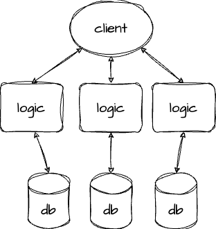
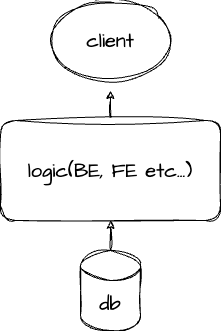

# MSA 란

- MSA는 "Microservices Architecture"의 약어로 소프트웨어 시스템을 구축하고 관리하기 위한
  아키텍처 스타일 중 하나이다.
- 이 아키텍처 스타일은 큰 *모놀리틱 애플리케이션*을 여러 작은 독립적인 서비스로 분해하는 것을 중심으로 한다.

 마이크로서비스아키텍처
 모놀리틱 아키텍처

> 모놀리틱 애플리케이션은 하나의 단일 코드베이스와 단일 실행 파일로 이루어진 전통적인 소프트웨어 애플리케이션 아키텍처를 의미한다. 모든 애플리케이션 기능과 서비스가 하나의 소프트웨어 시스템 내에서 통합되고 동작하는 구조를 가지고있다.
>
> 1. 흔히 백엔드 프론트가 각 서버랑 클라이언트 폴더를 파서 하는것도 모놀리틱에 가깝다.
> 2. 풀스택 프레임워크인 nextjs 또는 spring 또한 모놀리틱 애플리케이션이라 볼수있다.
> 3. 특징으로는 단일 코드베이스 , 단일 배포 단위 , 중앙 집중적 데이터 관리, 단일 기술 스택 등이 있다

## MSA 특징

각 서비스를 분해해서 각각 서비스를 배포하거나 독립적으로 서비스를 나눠서 운영하는것을 의미하는데
주요 특징과 이점을 알아보자.

1. 모듈성 : 애플리 케이션을 작은 모듈로 나누어서 개발자는 개별 서비스를 독립적으로 개발, 테스트, 및 유지보수 할 수 있다.
2. 확장성 : 각 서비스는 독립적으로 확장 가능하고 , 서비스 간의 상호 작용을 통해 애플리케이션 전체를 확장 할 수 있다.
3. 빠른 배포 : 서비스는 독립적으로 배포되므로 새로운 기능을 빠르게 출시 하거나 버그를 수정하기가 용이하다.
4. 다양한 기술 스택 : 각 서비스는 다른 기술 스택을 사용할 수 있으므로 가장 적합한 도구와 기술을 선택할 수 있다.
5. 견고성 : 한 서비스의 장애가 다른 서비스에 영향을 미치지 않도록 격리된 환경을 제공한다.
6. 민첩성 : 비지니스 요구사항의 변화에 빠르게 대응할수 있도록 도와준다.
7. 독립적인 데이터 관리 : 각 서비스는 자체 데이터 스토어를 가질수 있으며, 데이터베이스 선택은 서비스에 맞게 맞게 이루어진다.

## 단점

- 모놀리틱 아키텍처 에 비해 복잡하다. 내부 시스템 로직이라던가 통신을 어떻게 구성해야할지 깊게 고민해야한다.
- 각 비지니스로직마다 각각의 데이터베이스도 다르고 서비스도 다르기 때문에 서비스 연결에는 통신을 해야하는데 이과정에서 트랜잭션 유지가 어렵다. 분산 트랜잭션을 관리하려면 머리가 깨져야한다.
- 통합 테스트가 어렵다. 각 서비스가 독립적으로 개발되고 배포되기 때문에 서비스간의 통합 테스트가 힘들다.
- 실제 운영환경의 배포가 어렵다. 서비스 1개를 재배포 할 경우 다른 서비스들과 연계가 정상 작동하는지 확인해야한다.
- 인프라관리가 빡세다. 다수의 서비스와 팀이 관여하기때문에 복잡도가 엄청 증가한다.

## 마이크로서비스 아키텍처 패턴

1. **API 게이트웨이 (API Gateway)**:

   - API 게이트웨이는 클라이언트와 마이크로서비스 간의 중개자 역할을 하는 서비스다. 클라이언트 요청을 받아 마이크로서비스에 전달하고, 요청 및 응답을 필터링, 인증, 로깅, 로드 밸런싱 등을 처리할 수 있다.
   - API 게이트웨이를 사용하면 클라이언트와 서비스 간의 관리를 단순화하고 보안 및 모니터링을 효율적으로 수행할 수 있다.

2. **Circuit Breaker 패턴**:

   - Circuit Breaker 패턴은 네트워크 호출 또는 서비스 호출 시 장애가 발생할 경우 해당 호출을 끊고, 일정 시간 동안 다시 시도하지 않도록 하는 메커니즘을 제공한다.
   - 이 패턴을 사용하면 장애가 발생한 서비스에 대한 부하를 줄이고 전체 시스템의 안정성을 높일 수 있다.
   - 서비스 A가 서비스 B를 호출해서 데이터를 가져오거나 작업을 수행하는데 서비스 B에 장애가 발생하면, 서비스 B를 호출해도 응답을 받지 못할 수 있다. 서비스 A는 계속 지속적으로 요청을 보내는것을 멈추지않는다. 서킷브레이커를 도입하면 서비스 A가 서비스 B를 호출할때 일정 횟수의 연속 실패가 발생하면 서비스 B에 대한 요청을 중단하도록 설정

3. **Saga 패턴**:

   - Saga 패턴은 여러 마이크로서비스 간의 트랜잭션을 관리하기 위한 패턴으로, 복수 단계의 트랜잭션을 원자적으로 실행하고 롤백할 수 있게 해준다.
   - Saga 패턴은 장애가 발생해도 일부 트랜잭션 단계를 롤백하고 다른 단계를 완료하는 등의 조치를 취할 수 있어 데이터 일관성을 유지할 수 있다.

4. **CQRS (Command Query Responsibility Segregation) 및 이벤트 소싱 (Event Sourcing)**:
   - CQRS는 읽기와 쓰기 작업을 분리하는 아키텍처 패턴으로, 서비스에 읽기 전용 및 쓰기 전용 모델을 사용한다.
   - 이벤트 소싱은 모든 데이터 변경 사항을 이벤트로 저장하고, 이벤트를 사용하여 현재 상태를 계산하는 패턴이다. 데이터의 변경 이력을 추적하고, 데이터 복구 및 분석을 용이하게 한다.

## MSA 구현을위한 다양한 도구와 기술

1. 컨테이너 (Docker , Kubernetes)

   - Docker : 컨테이너 기술을 사용하여 애플리케이션과 그 종속성을 패키징하고 배포하는 데 사용된다. 애플리케이션을 환경과 무관하게 실행할 수 있도록 도와준다.
   - Kubernetes : 컨테이너 오케스트레이션 플랫폼으로, 여러 컨테이너화된 애플리케이션을 자동으로 배포, 관리 및 확장하는데 사용된다.

2. 서비스 오케스트레이션 (Kuberetes , Apache Mesos)

   - Kubernetes : 쿠버네티스는 위와같이 컨테이너 오케스트레이션 및 관리에 사용된다. 클러스터 내에서 컨테이너를 배포하고 관리하며 , 고가용성 및 확장성을 지원한다.
   - Apache Mesos : 클러스터 자원 관리를 위한 오픈소스 프레임워크로 , 컨테이너 오케스트레이션과 다양한 워크로드 관리에 사용된다.

3. 로깅 및 모니터링 도구(Prometheus, Grafana, ELK 스택)

   - Prometheus: 모니터링 및 경고 도구로, 시스템 및 애플리케이션의 상태를 수집하고 경고를 생성하는 데 사용된다.
   - Grafana: 모니터링 데이터를 시각적으로 표시하고 대시보드를 만드는 데 사용된다. Prometheus와 통합하여 사용할 수 있다.
   - ELK 스택 (Elasticsearch, Logstash, Kibana): 로그 데이터를 수집, 분석, 시각화하는 데 사용된다. Elasticsearch는 로그 저장소, Logstash는 데이터 수집, 변환, 전송을 처리하고, Kibana는 데이터를 시각적으로 탐색할 수 있도록 도와준다.

## 프론트엔드에서의 MSA

1. 마이크로 프론트엔드

- 프론트엔드 애플리케이션을 여러 개의 독립적인 마이크로 프론트엔드로 나누는 방식으로 MSA원칙을 반영할 수 있다. 각 마이크로 프론트엔드는 특정한 UI컴포넌트 또는 기능을 제공하며 , 독립적으로 개발 , 배포 , 및 관리된다. 이렇게 하면 프론트엔드에서도 서비스 분리와 독립성을 확보할 수 있다.

2. API 게이트웨이와 미이크로 프론트엔드

- 프론트엔드에서 MSA원칙을 적용할 때에 API 게이트웨이를 사용하여 클라이언트와 백엔드 서비스 간의 중계 역할을 하는 것이 유용할 수 있다. API 게이트웨이는 클라이언트에 필요한 데이터와 기능을 제공하며, 클라이언트는 여러 마이크로 프론트엔드를 통해 서비스에 접근할 수있다.

3. UI 컴포넌트 라이브러리

- 프론트엔드에서 MSA 원칙을 적용할 때에 , UI 컴포넌트 라이브러리를 사용하여 독립적인 UI 구성 요소를 개발하고 유지보수 할 수 있다. 이러한 컴포넌트는 다양한 마이크로 프론트엔드에서 재사용 될 수 있고, 각각의 마이크로 프론트엔드는 필요한 컴포는트를 조합해서 완전한 프론트엔드 애플리케이션을 구성할 수 있다.

4. 마이크로 프론트엔드 배포

- 마이크로 프론트엔드를 독립적으로 배포할 수 있도록 자동화된 CI/CD 파이프라인을 구축한다. 이를 통해 각 마이크로 프론트엔드가 독립적으로 업데이트되고 배포 될 수 있다.
