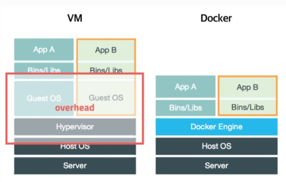

# docker

- 컨테이너 기반 가상화 도구
- 한 서버내에서 서버의 자원을 할당받아 새로운 환경을 생성하여 하나의 서비스를 추가로 할수있게끔할수있는 기술

## 도커 장점과 이점

- 환경 일관성 : 도커는 애플리케이션과 모든 종속성을 컨테이너로 패키징해 , 개발 환경과 프로덕션 환경 간의 일관성을 제공한다.
- 경량 및 빠른 시작 : 컨테이너는 가상 머신에 비해 훨씬 가벼우며 빠르게 시작된다.
- 스케일링 및 관리 용이성 : 도커 컨테이너를 사용하면 애플리케이션을 쉽게 확장하고 관리 할 수있다. 컨테이너 오케스트레이션 도구(쿠버네티스와 같은)와 통합 가능하다.
- 이미지 공유와 재사용 : 도커 이미지는 공개 및 비공개 레지스트리에 저장 및 공유할 수 있고 , 이미지를 재사용해 개발자 간 협업을 간편하게 한다.

## _기본 개념_

- **이미지**

도커 이미지는 애플리 케이션과 그 실행 환경, 종속성 등을 포함하는 패키지다.
이미지는 읽기 전용이고 컨테이너를 생성하는 템플릿으로 사용된다.

- 도커 이미지는 컨테이너를 실행하기 위한 모든 것을 포함한 파일 시스템 스냅샷이다.
- 이미지는 응용 프로그램의 코드, 런타임, 시스템 도구, 시스템 라이브러리 및 설정 파일을 포함하며, 컨테이너를 생성할 때 사용된다
- 이미지는 읽기 전용이며 변경되지 않는다.

도커를 이미지를 빌드하는 순서는

1. **도커이미지 생성** : 이미지를 만들기위한 `Dockerfile` 이라는 특수한 설정 파일을 사용해 이미지를 정의. `Dockerfile`은 애플리케이션과 그 종속성 , 환경 설정 들을 정의하고 이미지를 만들기 위한 모든 단계를 포함한다.
2. **도커 이미지 빌드** : `Dockerfile`을 사용해서 도커 빌드 명령어를 실행하면, 도커 엔진은 이미지를 생성하고 모든 레이어를 작성한다. 이 프로세스 중에 각 단계는 중간 레이어 즉 중간 이미지로 저장된다. 빌드된 이미지는 바이너리 형태로 저장되지만 이미지 자체를 직접 해석하거나 수정하는 것은 권장되지않는다.
3. **도커 이미지 저장** : 빌드된 이미지를 `.tar`파일로 저장할수있다. 이 파일은 이미지와 모든 레이어 정보를 포함한다.
4. **도커 이미지 불러오기** : 저장한 이미지를 다시 불러올 수 있고 , 다른 환경에서 이미지를 사용하거나 공유할 때 유용하다.

## 컨테이너

- _하이퍼 바이저_ 에 대항한 컨테이너 기반 가상화 도구
- 하이퍼바이저보다 가볍고 깔끔한 도구 애플리케이션과 모든 종속성을 포함하는 패키지로서 실행이됨.
- 컨테이너는 호스트 시스템의 커널(자원)을 공유해 더 가볍고 빠르게 시작되며 더 적은 오베헤드를 가진다.
- 또한 컨테이너는 격리된 환경을 제공하며, 각 컨테이너는 독립적으로 실행 되지만 더 적은 시스템 리소스를 사용한다.

> **하이퍼바이저** 는 전통적인 가상화 기술로, 호스트 시스템에서 여러 개의 가상 머신(가상 머신 또는 VM)을 실행하는 데 사용됩니다. 하이퍼바이저는 물리적 서버의 리소스를 가상 머신에 할당하고, 각 가상 머신은 독립적으로 운영 체제를 실행합니다. 이러한 가상 머신은 하드웨어 가상화를 통해 호스트 시스템과 격리되며, 서로 영향을 주지 않습니다

## 도커엔진

- 도커엔진은 도커 이미지를 관리하고 컨테이너를 실행하는 핵심 컴포넌트다.
- 이 엔진은 도커 데몬과 도커 CLI 로 구성되고 이미지 빌드, 컨테이너 관리 , 네트워킹 및 데이터 볼륨 관리를 수행한다.

## 도커스웜 , 클러스터

- 도커스웜은 도커 클러스터를 구축하고 관리하는 도구다.
- 도커 스웜을 사용하면 여러 도커호스트 즉 여러 도커 엔진을 가진 서버들을 하나의 클러스터로 그룹화해서 컨테이너를 분산 관리할 수 있다.
  이를 통해서 확장성, 고가용성 및 부하 분산을 구현할 수있다.

## 도커 컴포즈

- 도커 컴포즈는 여러 컨테이너로 구성된 애플리 케이션을 정의하고 실행하기 위한도구다.
- yml 파일을 사용해서 애플리케이션의 서비스, 네트워크 , 볼륨 및 환경 변수를 정의할 수 있고, 단일 명령어로 여러 컨테이너를 실행하고 관리할 수있다.

### 사용예시

> 만약 내가 쇼핑몰 프로젝트를 하는데 풀스텍으로 웹애플리케이션을 짯다 . 프론트는 nextjs 백엔드는 springboot nginx redis mysql
> 이렇게 기술스택을 정했으면 다음 순서에 맞게

1. Dockerfile 작성 : 컨테이너 이미지를 빌드하는데 단계와 지침 정의

- (springboot에서의 Dockerfile , nextjs프론트엔드에서의 Dockerfile , Nginx 리버스 프록시의 Dockerfile은 Nginx 설정 파일과 함께 Nginx 이미지를 사용할 수 있다.)

2. 도커 이미지 빌드 : 컨테이너 이미지를 빌드
3. 도커 컴포즈 파일 작성 : yml 파일을 사용해서 환경 변수 , 볼륨 및 네트워크 서비스를 정의하고 단일 명령어로 여러 컨테이너를 싱행할수있게 관리
4. 컨테이너 실행 : 이미지가 빌드되면 이 이미지를 사용해서 컨테이너를 생성하고 실행해보기

### 질문

- **도커 컨테이너와 하이퍼바이저 의 주요 차이점은 무엇인가요?**

도커 컨테이너와 가상 머신(Virtual Machine)의 주요 차이점은 도커 컨테이너가 호스트 운영 체제의 커널을 공유하며 가상화 오버헤드가 적다는 것입니다. 반면, 가상 머신은 완전히 독립된 운영 체제와 커널을 갖기 때문에 더 무겁고 오버헤드가 큽니다.

- **도커 이미지와 도커 컨테이너의 관계는 어떻게 되나요?**

도커 이미지는 컨테이너 실행을 위한 파일 및 설정의 스냅샷이며, 도커 컨테이너는 해당 이미지에서 생성되는 실행 가능한 인스턴스입니다. 도커 이미지는 컨테이너를 실행하기 위한 템플릿이라고 생각할 수 있습니다.

- **도커 컴포즈(Compose)란 무엇이며, 어떤 상황에서 사용되는가?**

도커 컴포즈(Compose)는 여러 도커 컨테이너를 정의하고 구성하기 위한 도구로, 단일 파일(일반적으로 docker-compose.yml)에 서비스 및 네트워크 설정을 정의하여 여러 컨테이너를 한 번에 실행하고 관리하는 데 사용됩니다.

- **도커 허브(Docker Hub)는 어떤 역할을 하며, 도커 이미지 관리 및 배포에 어떻게 활용되는가?**

도커 허브(Docker Hub)는 도커 이미지를 공개 및 개인 저장소에서 관리하고 공유하기 위한 클라우드 기반 도커 이미지 레지스트리 서비스입니다. 도커 이미지를 도커 허브에 업로드하고 다운로드하여 이미지를 공유하고 도커 컨테이너를 배포할 수 있습니다.

- **도커 네트워킹의 주요 유형은 무엇이며, 각 유형의 특징은 무엇인가요?**
  도커 네트워킹의 주요 유형은 브리지(Bridge), 호스트(Host), none, 및 커스텀(Custom) 네트워크입니다. 브리지 네트워크는 컨테이너 간에 연결할 수 있는 기본 네트워크 유형이며, 호스트 네트워크는 호스트와 동일한 네트워크를 공유합니다. None 네트워크는 네트워크 연결을 하지 않는 옵션입니다. 커스텀 네트워크는 사용자가 직접 정의한 네트워크로, 컨테이너 간에 특정 네트워크 연결을 구성할 수 있습니다.

- **도커 볼륨(Volume)은 무엇이며, 언제 사용되며 어떤 이점이 있나요?**

도커 볼륨은 컨테이너에서 데이터를 저장하고 공유하기 위한 도커 기능입니다. 도커 볼륨을 사용하면 데이터를 컨테이너 외부에 보관하고, 여러 컨테이너 간에 데이터를 공유하거나 데이터를 영속적으로 유지할 수 있습니다. 이를 통해 컨테이너의 데이터를 유지하고 컨테이너 간에 데이터를 공유할 수 있으며, 도커 볼륨을 사용하면 데이터 손실을 방지하고 데이터 보존을 지원할 수 있습니다.
