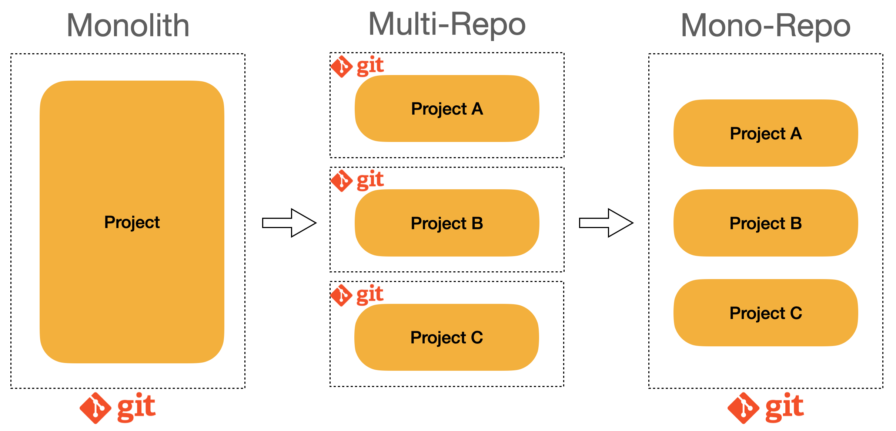

# MonoRepo

"모노레포란 잘 정의된 관계를 가진 , 여려개의 독립적인 프로젝트들이 있는 하나의 레포지토리"

1. 여기서 주목해야할점은 잘 정의된 관계
2. 프로젝트간의 관계가 잘 정의되어있고 개발자의 생산성을 올려주어야한다.

## 왜 모노레포 인가 ?

### 멀티레포의 문제점

Project A 와 비슷한형태의 Project가 새로 추가되야하는 상황

1. 새로운 프로젝트B 레포지토리를 추가한다.
2. ci/cd, lint , test, ts등등의 설정을 새로 해준다.
3. 프로젝트 A에서 재사용하고 싶은 코드가 있는 경우에는 이를 위한 라이브러리르 A 레포지토리를 새로 만들어준다.
4. 반복 두번

- **이로인한 문제점**

1. 새 프로젝트 생성 비용이 큼
2. 프로젝트간 코드 공유가 어려움
3. 같은 이슈를 수정하기 위해 각각의 레포지토리에 커밋이 필요
4. 히스토리 관리의 어려움
5. 제각각인 툴링으로 개발자 경험이 일관적이지 않음

### 모노레포가 해결해주는것

1. 새 프로젝트 생성 비용이 작음
2. 프로젝트간 코드 공유가 쉬움
3. _Atomic commits_
4. 히스토리 관리가 쉬움
5. 공통된 툴링으로 일관적인 개발자 경험 제공

But 모노레포는 앞서말한것처럼 잘 정의된 관계를 프로젝트가 담겨야하고 하나의 레포지토리에 모든것을 담으면 오히려 복잡해질수있다.

## 모노레포 구조

## 모노레포 Features

- Local computation caching (로컬 캐싱)
- Local task orchestration (테스크관리)
- Distributed computation caching (원격저장캐싱 빠른작업수행)
- Detecting affected projects / packages (변경된 프로젝트 감지)

### **라이브러리 모노레포:**

- **주요 특징:** 라이브러리 모노레포는 여러 라이브러리나 패키지를 포함하는 단일 레포지토리.
  - 1. 의존성 관리
    - node_modules의 문제점 : 비어있거나 깨져있는것이 많다. 더욱큰문제는 유령의존성(Phantom Dependecy) npm은 중복해서 모듈들을 피하기위해서 호이스팅 기법을 사용하는데 이로인해 명시되지않은 모듈을 불러올수있다. 이는 의존성관리를 혼란스럽게하는데 최악으론 런타임 에러가 발생할 수 있다.
    - 이러한 의존성 관리 문제점을 피하기위해 Yarn berry + PnP 방식을 사용
    - peer dependency
  - 2. 버전 관리.
- **적용 대상:** 주로 공통 기능을 제공하는 여러 라이브러리를 관리하고자 할 때 사용한다. 각 라이브러리는 독립적으로 테스트되고 빌드되며, 개별적으로 배포될 수 있다.
- **장점:** 코드 공유와 재사용이 용이하며, 라이브러리 간의 의존성을 관리하기 쉽다.
- **예시:** 웹 프레임워크, 유틸리티 라이브러리, 데이터베이스 연동 라이브러리 등을 포함하는 레포지토리.

### **서비스 모노레포:**

- **주요 특징:** 서비스 모노레포는 여러 독립적인 서비스를 포함하는 단일 레포지토리.
- **적용 대상:** 주로 마이크로서비스 아키텍처를 사용하는 경우, 각각의 마이크로서비스를 독립적으로 개발, 배포, 테스트하고자 할 때 사용한다.
- **장점:** 서비스 간의 통합이 용이하며, 전체 시스템을 한 번에 관리할 수 있다.
- **예시:** 사용자 관리 서비스, 결제 서비스, 인증 서비스 등을 포함하는 레포지토리.

## 언제 모노레포를 사용할까 ?

1. **비슷한 서비스들을 만들 때**: 한 서비스의 모바일 페이지, PC 페이지를 만들어야 할 경우 공통 로직들이 있을 수 있기 때문에 모노레포로 구성하는 것이 좋다.
2. **여러 프로젝트를 한 눈에 파악해야 할 때**
