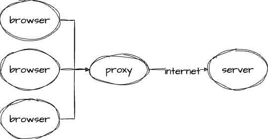

- [프록시 (Proxy)](#프록시-proxy)
  - [프록시서버의 종류와 역할](#프록시서버의-종류와-역할)
    - [Forward Proxy](#forward-proxy)
    - [Reverse Proxy](#reverse-proxy)
  - [단점](#단점)

# 프록시 (Proxy)

- 프록시란 대리(행위)나 대리권, 대리 투표, 대리인 등을 뜻한다.
- 웹개발에서 프록시는 아주 다양하게 쓰인다. 프로토콜에 있어서는 응답이나 결과처리 등에 쓰인다.

## 프록시서버의 종류와 역할

- 프록시 서버는 클라이언트에서 사용하는 `Forward Proxy` , 서버에서 사용하는 `Reverse Proxy` 가 존재한다.

### Forward Proxy

- `Forward Proxy` 는 일반적으로 프록시를 말하면 `Forward Proxy`를 뜻하는데 client와 server사이에 요청을 중계한다.
- 그리고 `Forward Proxy`는 보통 '**우회**' 의 느낌으로 사용된다. 이는 보안을 위한 방법으로 어디서 접속을 했는지 숨기기 위해서 사용이 많이 된다.

그렇다면 왜 굳이 중간 서버를 두어서 직접연결이아닌 한번 거쳐서 가야할까 ?
아래 역할을 보자

- `Forward Proxy`의 역할

  - **클라이언트 익명성**

    - 클라이언트의 IP 주소를 숨기고 대신 프록시 서버의 IP 주소를 외부 서버에 노출시킴으로써 클라이언트 익명성을 제공한다.

  - **접근 제어 및 필터링**

    - 클라이언트가 특정 웹 사이트 또는 리소스에 액세스할 때 요청을 제어하고 필터링할 수 있다.예 ) 브라우저가 지정한 불필요한 헤더 제거 등

  - **캐싱**

    - 클라이언트 요청과 외부 서버 응답을 캐시하여 동일한 요청에 대한 반복 액세스를 가속화하고 네트워크 대역폭을 절약할 수 있다.

  - **보안**

    - 보안 및 방화벽 정책을 강화할 수 있으며, 악의적인 트래픽이나 악성 코드를 감지하고 차단할 수 있다.

  - **로드 밸런싱** - `Forward Proxy`는 여러 서버로 요청을 분산하고 로드 밸런싱을 수행할 수 있다
  - 그 외 기타 - 프론트엔드의 숙명과도 같은 Cors 우회 쌉가능

### Reverse Proxy

- `Reverse Proxy` 는 일반적으로 클라이언트 요청을 서버로 전달하고 서버의 응답을 클라이언트에 다시 전달하는 중간 서버이다.
- 주로 `nginx` , `apache` 등을 사용한다.

`Forward Proxy`랑 마찬가지로 역할은 비슷하나 하는일은 포워드보다 더 많을수 있다.

- **클라이언트 요청의 중계**

  - 클라이언트가 웹 서버 또는 애플리케이션 서버에 요청을 보낼 때 중간에서 클라이언트 요청을 받는다.

- **로드 밸런싱**

  - 여러 서버 또는 서버 팜(서버 클러스터) 사이에서 요청을 분산하는 로드 밸런서 역할을 수행할 수 있다. 트래픽을 적당히 분산시키고 성능을 최적화한다.

- **보안 및 인증**

  - 클라이언트 및 서버 간의 통신을 중개하므로 보안 및 인증을 제어할 수가 있다. SSL 암호화, 인증, 액세스 제어 및 보안 정책 적용을 통해 네트워크 보안을 강화할 수 있다.

- **캐싱**

  - 요청한 데이터를 캐싱하여 이전에 요청한 데이터를 다시 제공함으로써 서버 부하를 줄이고 응답 시간을 단축할 수 있다. 특히 정적 콘텐츠에 대한 캐싱이 효과적이다. 예) 정적파일 font , html 등을 서빙

- **애플리케이션 가용성 및 고가용성**

  - 여러 서버 간의 페일오버(Failover) 및 고가용성을 지원할 수 있으며, 하나의 서버가 다운되면 다른 서버로 요청을 전달합니다.

- **프록시 서버**

  - 클라이언트와 서버 간의 상호작용에서 중개 역할을 하므로 서버의 실제 IP 주소를 감추는데 사용될 수 있다. `Forward Proxy`랑 마찬가지로 보안 , 익명성을 지키는데 사용

- 그 외 기타
  - 필터링 , 압축 등 진짜 서버보다 일을 더 잘한다 . 예) 압축 , 압축해제를 통해 대역폭 사용을 줄이고 로딩시간을 줄일수있음

## 단점

이러한 많은 장점들을 가지고있는데 단점들을 살펴보자

- 단일 장애점: 프록시 서버가 다운되면 클라이언트와 서버 간의 통신이 중단될 수 있으며, 이로 인해 서비스 중단이 발생할 수 있다.

- 성능 저하: 프록시 서버를 통과하면 추가적인 네트워크 지연이 발생할 수 있으며, 성능을 저하시킬 수 있다.

- 설정 및 관리 복잡성: 프록시 서버의 설정과 관리는 복잡할 수 있으며, 오용을 방지하려면 주기적인 감시가 필다.

- 보안 취약점: 프록시 서버 자체가 보안 취약점을 가질 수 있으며, 잘못된 구성으로 인해 보안 위험이 증가할 수 있다.
