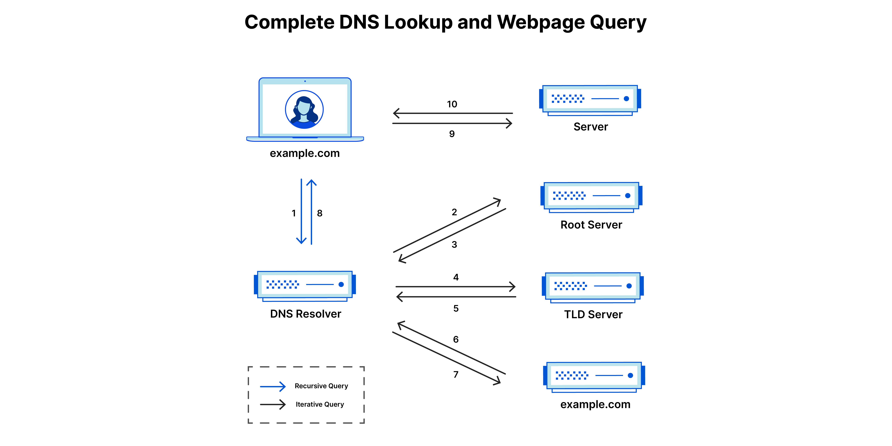

# DNS

---

- DNS란 Domain Name System의 약자로 인터넷 주소창에 Host Domain Name을 입력했을 때 해당 문자를 IP주소로 변환해주는 시스템
- 인터넷에 연결된 각 기기에는 다른 컴퓨터가 기기를 찾는데 사용하는 고유한 ip 주소가 있다.
- DNS서버를 사용하면 ipv4 (192.168.1.1) ipv6 (2400:cb00:2048:1::c629:d7a2) 와 같은 주소를 기억할 필요없다.
- [Naver.com](http://naver.com/) , [Daum.net](http://daum.net/) 등 -> 전화번호를 이름으로 저장하는것과 비슷

## 💡 **DNS는 어떻게 작동하지?**

- DNS 확인 프로세스에는 호스트 이름(예: www.example.com)을 컴퓨터 친화적인 IP 주소(예: 192.168.1.1)로 변환하는 과정이 포함한다. IP 주소는 인터넷의 각 기기에 제공되며, 거리 주소가 특정한 집을 찾는 데 사용되는 것처럼, 적절한 인터넷 기기를 찾기 위해서는 IP 주소가 필요하다. 사용자가 어떤 웹페이지를 로드하려고 할 때에는 사용자가 웹브라우저에 입력한 내용(예: example.com)을 example.com 웹페이지를 찾는 데 필요한 컴퓨터 친화적 주소로 변환해야 한다.

- DNS 확인의 기반 프로세스를 이해하려면, DNS 쿼리가 통과해야 하는 다양한 하드웨어 구성 요소에 대해 알아야 한다. 웹브라우저 입장에서는 DNS 확인이 "막후에서" 발생하며 최초의 사용자 요청 외에 사용자 컴퓨터와의 추가적인 대화는 x.

### **DNS 조회는 어떤 단계를 거칠까?**

- 대부분의 경우, DNS는 도메인 이름을 적절한 IP 주소로 변환하는 일에 관여. 이 프로세스의 작동 방식을 알려면, 웹 브라우저에서 DNS 조회 프로세스를 거쳐 다시 돌아오는 DNS 조회 경로를 따르는 것이 좋다.
   

> 참고: DNS 조회 정보는 쿼리 컴퓨터 내부에서 로컬로 또는 DNS 인프라에서 원격으로 캐시되는 경우가 많습니다. DNS 조회에는 일반적으로 8단계가 있지만, **DNS 정보가 캐시되어 있으면 DNS 조회 프로세스에서 몇 단계를 건너 뛸 수 있으므로, 더 빨라집니다.** 아래 예시는 캐시되지 않은 8단계를 모두 보여줍니다.
> 

 

- **DNS Resolver**
  - DNS Resolver는 클라이언트 측 소프트웨어 또는 DNS 조회 시작을 담당하는 네트워크 구성 요소.다양한 DNS 서버와 통신하여 도메인 이름을 IP 주소로 확인한다.
- **Root Server**
  - **Root** 서버는 DNS 인프라의 중요한 부분. 최상위 도메인(.com, .org, .net 등)에 대한 정보를 유지 관리하는 신뢰할 수 있는 서버 집합. 전 세계적으로 13개의 루트 서버 클러스터가 있으며 각각은 A에서 M까지의 문자로 식별. 주요 기능은 적절한 TLD 서버에 참조를 제공하는 것.
- **TLD Server**
  - TLD 서버는 .com, .org, .net과 같은 최상위 도메인과 .us, .uk 등과 같은 국가 코드 TLD를 처리할 책임이 있다. 이러한 서버는 해당 TLD에 등록된 도메인 이름에 대한 정보를 유지한다. 예를 들어 .com으로 끝나는 도메인 이름을 조회하는 경우 .com용 TLD 서버는 해당 도메인 이름을 확인하는 데 필요한 정보를 갖게 된다.
- **DNS Server** - DNS 서버는 도메인 이름을 IP 주소에 매핑하는 **DNS 레코드**를 저장하고 관리한다. 신뢰할 수 있는 DNS 서버 및 재귀 DNS 서버를 포함하여 여러 수준의 DNS 서버가 있다. - **Authoritative DNS Server**: **Authoritative DNS Server**는 특정 도메인에 대한 DNS 레코드를 저장하고 제공하는 역할을 한다. DNS 해석기는 도메인 이름을 쿼리할 때 해당 도메인과 연결된 신뢰할 수 있는 DNS 서버에 연결하여 해당 IP 주소 또는 기타 DNS 레코드를 얻는다. - **Recursive DNS Server**: Recursive DNS Server는 일반적으로 인터넷 서비스 공급자(ISP) 또는 타사 DNS 공급자가 제공한다(third-party DNS provider). DNS resolver가 쿼리를 받으면 **Recursive DNS Server**에 연결하여 클라이언트를 대신하여 도메인 이름을 확인할 수 있다. **Recursive DNS Server**는 캐시에 요청된 정보가 없으면 루트 서버에서 시작하여 요청된 도메인의 IP 주소를 얻을 때까지 DNS 계층 구조를 재귀적으로 통과한다.
     

### DNS 조회의 8단계

1. 사용자가 웹 브라우저에 'example.com'을 입력하면, 쿼리가 인터넷으로 이동하고 DNS 재귀 확인자가 이를 수신.
2. 이어서 확인자가 DNS 루트 이름 서버(.)를 쿼리.
3. 다음으로, 루트 서버가, 도메인에 대한 정보를 저장하는 최상위 도메인(TLD) DNS 서버(예: .com 또는 .net)의 주소로 확인자에 응답. example.com을 검색할 경우의 요청은 .com TLD를 가리킨다.
4. 이제, 확인자가 .com TLD에 요청.
5. 이어서, TLD 서버가 도메인 이름 서버(example.com)의 IP 주소로 응답.
6. 마지막으로, 재귀 확인자가 도메인의 이름 서버로 쿼리를 보낸다.
7. 이제, example.com의 IP 주소가 이름 서버에서 확인자에게 반환.
8. 이어서, DNS 확인자가, 처음 요청한 도메인의 IP 주소로 웹 브라우저에 응답.

DNS 조회의 8단계를 거쳐 example.com의 IP 주소가 반환되면, 이제 브라우저가 웹 페이지를 요청할 수 있다.

1. 브라우저가 IP 주소로 [HTTP](https://www.cloudflare.com/learning/ddos/glossary/hypertext-transfer-protocol-http/) 요청을 보낸다.
2. 해당 IP의 서버가 브라우저에서 렌더링할 웹 페이지를 반환(10단계).

- 이 과정들은 브라우저에서 서비스.

## DNS 캐싱이란 ? DNS 캐싱은 어디서 발생할까?

- 캐싱의 목적은 데이터를 임시 저장하여, 데이터 요청에 대해 성능과 신뢰성을 높이는 것. DNS 캐싱은 요청하는 클라이언트와 가까운 곳에 데이터를 저장함으로써, DNS 쿼리를 조기에 확인할 수 있고 DNS 조회 체인의 추가 쿼리를 피할 수 있으므로, 로드 시간이 향상되고 대역폭/CPU 소비가 줄어든다. DNS 데이터는 다양한 위치에 캐시될 수 있으며, 각 위치는 TTL(Time-To-Live)에 의해 정의된 설정 시간 동안 DNS 레코드를 저장한다.

### 브라우저 DNS 캐싱

- 최신 웹 브라우저는 기본적으로 정해진 시간 동안 DNS 레코드를 캐시하도록 설계되었다. 그 목적은 분명하다. DNS 캐싱이 웹 브라우저와 가까울수록 캐시를 확인하고 IP 주소에 대한 올바른 요청을 하기 위해 처리해야 할 단계가 적어진다. DNS 레코드를 요청할 때 브라우저 캐시에서 처음으로 요청한 레코드를 확인하는 것.
     
- **DNS Record Type ⇒ 위사진 7번과정**

  - 레코드 타입
    
    - 레코드 설명
      1. **A 레코드**(주소 레코드): 가장 일반적인 DNS 레코드 유형. 도메인 또는 하위 도메인을 IPv4 주소로 지정하는 데 사용.
      2. **AAAA 레코드**(쿼드 A 레코드): A 레코드와 유사하지만 도메인 또는 하위 도메인을 IPv6 주소로 가리키는 데 사용.
      3. **CNAME 레코드**(정식 이름 레코드): 이 레코드는 한 도메인 이름에서 다른 도메인 이름으로 별칭을 만든다. 예를 들어 [www.example.com](http://www.example.com/)을 example.com의 별칭으로 만들어 두 도메인 이름이 동일한 웹사이트로 연결되도록 할 수 있다.
      4. **MX 레코드**(메일 교환 레코드): 이 레코드는 도메인을 대신하여 이메일 메시지 수락을 담당하는 메일 서버를 가리킨다.
      5. **NS 레코드**(네임 서버 레코드): 이 레코드는 도메인에 대한 권한이 있는 네임 서버를 가리킨다. 이것은 일반적으로 도메인 등록 기관에서 설정되며 도메인에 대한 다른 레코드를 찾을 위치를 DNS 시스템에 알려준다.
      6. **SOA 레코드**(권한 레코드 시작): 이 레코드는 기본 이름 서버, 도메인 관리자의 이메일, 도메인 일련 번호 및 영역 새로 고침과 관련된 여러 타이머를 포함하여 도메인에 대한 중요한 세부 정보를 제공한다.
      7. **TXT 레코드**(텍스트 레코드): 이 유형의 레코드를 사용하면 관리자가 임의의 텍스트를 DNS 레코드에 삽입할 수 있다. 이는 이메일 유효성 검사를 위한 SPF(Sender Policy Framework) 레코드 또는 Google 웹마스터 도구와 같은 서비스의 도메인 확인과 같은 다양한 유형의 유효성 검사에 자주 사용다.
      8. **SRV 레코드**(서비스 레코드): 이 레코드는 도메인 이름의 일부로 사용되는 기호 이름과 전송 프로토콜을 정의. 레코드 콘텐츠에서 서비스에 대한 우선 순위, 가중치, 포트 및 대상을 정의한다.
      9. **PTR 레코드**(포인터 레코드): 이 유형의 레코드는 DNS 역방향 조회에 사용되며 IP 주소를 도메인 이름에 매핑한다(A 또는 AAAA 레코드의 반대).

- Nameserver는 무조건 공인된 애들한테만 -> 악의적인 사용자가 있기때문
- sub domain 활용 잘하면 도메인 값 아낄수있음
